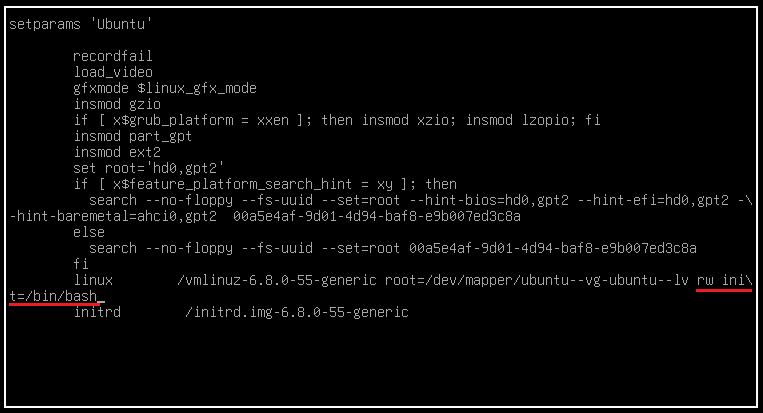

Um passo a passo para para resetar a senha de qualquer usuário (incluindo o **root**) no **Ubuntu** utilizando o menu do **GRUB** para acessar um *shell* de recuperação.

## 1. Acessar o Menu do GRUB

1. **Reinicie** o seu sistema Ubuntu.
2. Mantenha a tecla `Shift` pressionada (ou, em sistemas **UEFI**, pressione a tecla `Esc` repetidamente) durante o início da inicialização para forçar a exibição do menu do **GRUB** (se ele não aparecer automaticamente).
3. Use as setas para selecionar a opção do seu kernel atual, geralmente a primeira linha.
4. Pressione a tecla `e` para editar os parâmetros de inicialização.

---

## 2. Editar a Linha de Inicialização

1. Na tela de edição, use as setas para baixo para encontrar a linha que começa com `linux`.
2. Nessa linha, procure o parâmetro `ro` (read-only) e substitua-o por `rw` (read-write).
3. Vá para o final dessa mesma linha e adicione o seguinte:
    
    ```shell  
    init=/bin/bash
    ```

    O final da linha modificada deve se parecer com: `... ro quiet splash rw init=/bin/bash`
4. Pressione `Ctrl+X` para iniciar o sistema com esses novos parâmetros. O sistema fará o boot diretamente para um *shell* de root (`#`).
    
    

---

## 3. Alterar a Senha do Usuário

No *shell* de *root* que apareceu, você pode redefinir a senha de qualquer usuário usando o comando `passwd`.

### 3.1. Resetar a Senha de um Usuário Padrão

Se você quer resetar a senha de um usuário comum (ex: `joao`):

1. Execute o comando `passwd` seguido do nome de usuário:    
    ```shell
    passwd joao    
    ```
2. Digite a **nova senha** e confirme-a.

### 3.2. Resetar a Senha do Root (Superusuário)

O Ubuntu normalmente desativa a conta de *root* por padrão, mas você pode ativá-la (e definir sua senha) se necessário:

1. Execute o comando `passwd` sem argumentos:
    ```shell
    passwd root
    ```
2. Digite a **nova senha** e confirme-a.

---

## 4. Finalizar e Reiniciar

1. Após a alteração da senha, você precisa **reiniciar o sistema** para que as alterações tenham efeito e o sistema volte a inicializar normalmente. Use o comando `exec` para restaurar o processo de inicialização:
    ```shell
    exec /sbin/init 6 
    ```
2. O sistema irá reiniciar e você poderá fazer *login* com a nova senha definida para o usuário escolhido.