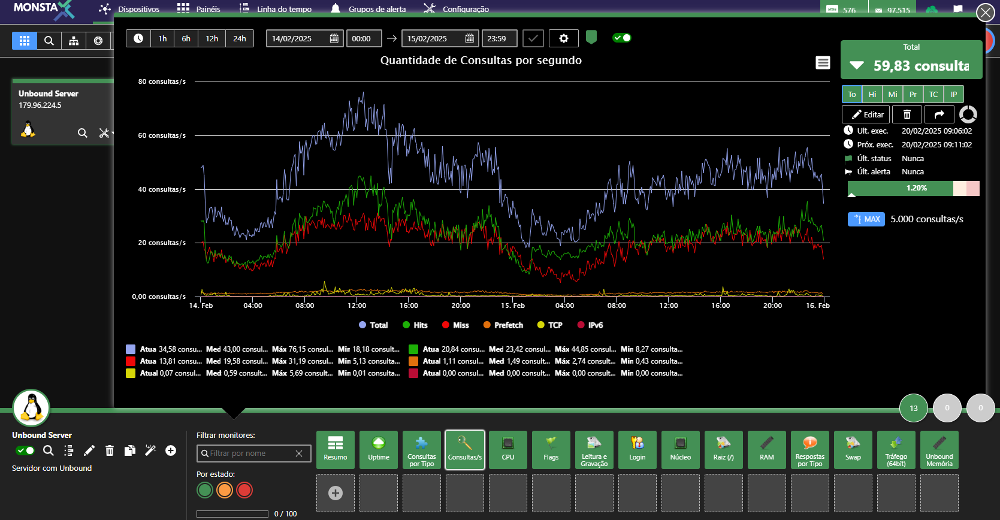

Tutorial para monitorar o servidor DNS Unbound através do serviço de SNMP.



:::note
Os comandos Linux deste tutorial são compatíveis com distribuições Linux como CentOS e Fedora Server. Caso utilize outra distribuição (como Debian ou Ubuntu), comandos como `yum`, por exemplo, precisarão ser substituídos. 
:::

## Instalação do Unbound

Para instalar o servidor DNS Unbound e configurá-lo para iniciar automaticamente, digite os comandos abaixo:

```shell
yum install unbound
systemctl enable unbound
systemctl start unbound
```

## Configuração

Edite o arquivo `/etc/unbound/unbound.conf` e habilite a opção para gerar estatísticas conforme abaixo:

`extended-statistics: yes`

O exemplo a seguir mostra uma configuração básica do servidor DNS Unbound com a opção para exibição de estatísticas extendidas habilitada.

```bash
server:
  verbosity: 1
  satistics-interval: 0
  statistics-cumulative: no
  extended-statistics: yes
  num-threads: 2
  interface: 0.0.0.0
  interface-automatic: yes
  outgoing-range: 5000
  so-rcvbuf: 4m
  so-sndbuf: 4m
  msg-cache-size: 25m
  msg-cache-slabs: 2
  num-queries-per-thread: 2500
  rrset-cache-size: 50m
  rrset-cache-slabs: 2
  infra-cache-slabs: 2
  access-control: 0.0.0.0/0 allow
  chroot: ""
  username: "unbound"
  directory: "/etc/unbound"
  log-time-ascii: yes
  pidfile: "/var/run/unbound/unbound.pid"
  harden-glue: yes
  harden-dnssec-stripped: yes
  harden-below-nxdomain: yes
  harden-referral-path: yes
  use-caps-for-id: no
  unwanted-reply-threshold: 10000000
  prefetch: yes
  prefetch-key: yes
  rrset-roundrobin: yes
  minimal-responses: yes
  trusted-keys-file: /etc/unbound/keys.d/*.key
  auto-trust-anchor-file: "/var/lib/unbound/root.key"
  val-clean-additional: yes
  val-permissive-mode: no
  val-log-level: 1
  key-cache-slabs: 2
  include: /etc/unbound/local.d/*.conf

remote-control:
  control-enable: yes
  server-key-file: "/etc/unbound/unbound_server.key"
  server-cert-file: "/etc/unbound/unbound_server.pem"
  control-key-file: "/etc/unbound/unbound_control.key"
  control-cert-file: "/etc/unbound/unbound_control.pem"
  include: /etc/unbound/conf.d/*.conf
```

## Reiniciando o serviço unbound

Após, reinicie o serviço com o comando:

```shell
systemctl restart unbound
```

## Configurando o SNMP para enviar as estatísticas do Unbound

:::note
Caso seu sistema não tenha o servidor SNMP configurado, veja [Configurando o SNMP no Linux](/pt-br/extra/linux/snmp-linux)
:::

Faça um backup do arquivo /etc/snmpd.conf:

```shell
mv /etc/snmp/snmpd.conf /etc/snmp/snmpd.conf.backup
```

Edite o arquivo /etc/snmp/snmpd.conf e configure-o conforme exemplo abaixo. Se desejar, altere o nome da comunidade.

```text
rocommunity public
extend .1.3.6.1.3.1983.1.1 Unbound /usr/bin/cat /tmp/unbound_stats.txt
```

## Reiniciando e habilitando o serviço SNMP

Na tela de terminal, digite:

```shell
systemctl restart snmpd
```

## Adicionando as estatísticas na cron

Na tela de terminal, digite o comando abaixo:

```shell
(crontab -l ; echo '*/1 * * * * /usr/sbin/unbound-control stats_noreset > /tmp/unbound_stats.txt' ) | crontab -
```

Após esses procedimentos, já é possível utilizar o Template “Unbound – DNS Server” para monitorar as estatísticas do seu servidor de DNS.

## Extra

Em alguns sistemas o comando cat encontra-se em um diretório diferente do configurado no arquivo snmpd.conf. Para evitar problemas, você pode criar um link simbólico com o comando abaixo:

```shell
ln -s /usr/sbin/cat /bin
```

## Teste das configurações

Para testar se as configurações feitas estão corretas, execute os passos abaixo:

```shell
yum install net-snmp-utils
snmpwalk -c public -v2c localhost .1.3.6.1.3.1983.1.1
```

O comando snmpwalk deverá retornar informações conforme o exemplo abaixo:

> SNMPv2-SMI::experimental.1983.1.1.1.0 = INTEGER: 1\
> SNMPv2-SMI::experimental.1983.1.1.2.1.2.7.85.110.98.111.117.110.100 = STRING: "/usr/bin/cat"\
> SNMPv2-SMI::experimental.1983.1.1.2.1.3.7.85.110.98.111.117.110.100 = STRING: "/tmp/unbound_stats.txt"\
> SNMPv2-SMI::experimental.1983.1.1.2.1.4.7.85.110.98.111.117.110.100 = ""\
> SNMPv2-SMI::experimental.1983.1.1.2.1.5.7.85.110.98.111.117.110.100 = INTEGER: 5\
> SNMPv2-SMI::experimental.1983.1.1.2.1.6.7.85.110.98.111.117.110.100 = INTEGER: 1\
> SNMPv2-SMI::experimental.1983.1.1.2.1.7.7.85.110.98.111.117.110.100 = INTEGER: 1\
> SNMPv2-SMI::experimental.1983.1.1.2.1.20.7.85.110.98.111.117.110.100 = INTEGER: 4\
> SNMPv2-SMI::experimental.1983.1.1.2.1.21.7.85.110.98.111.117.110.100 = INTEGER: 1
