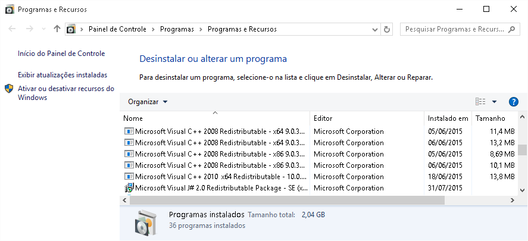
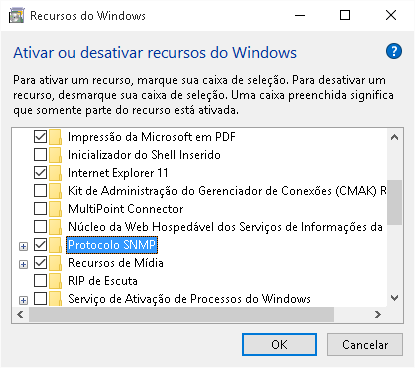
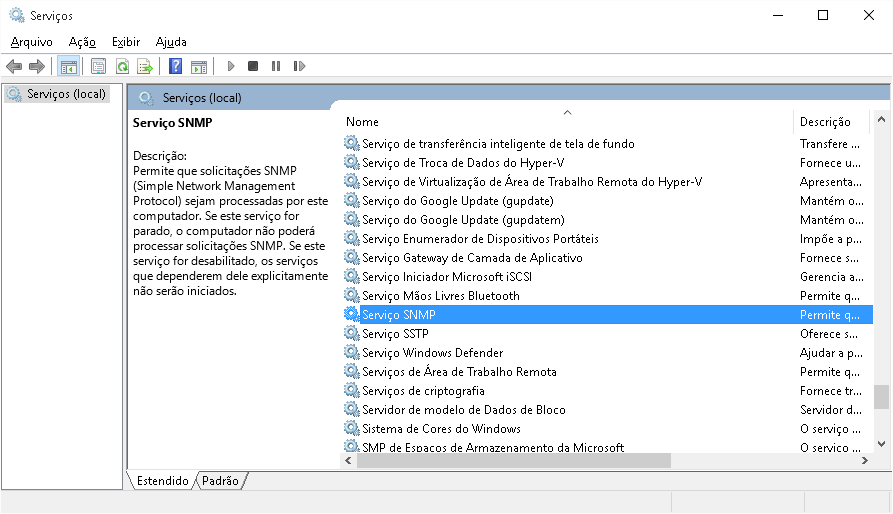
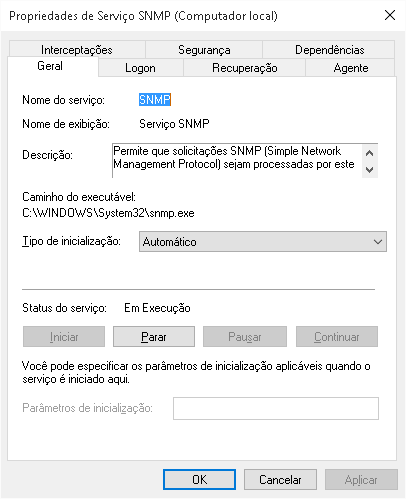
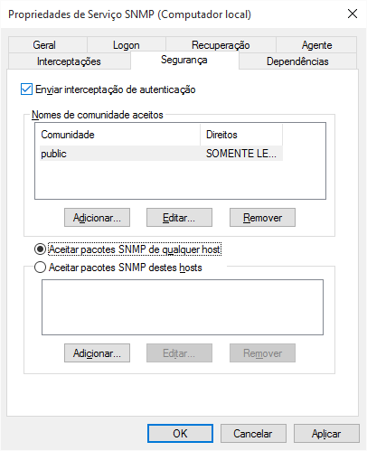

Tutorial com objetivo de ativar uma configuração básica dos serviços SNMP em Sistemas Operacionais Windows.

## Configurar o serviço SNMP

Logado como administrador, no prompt de comando digite:

```powershell
control appwiz.cpl
```

A seguinte tela será mostrada:



• Clique em “Ativar ou desativar recursos do Windows”;

  
• Marque o item “Protocolo SNMP” e clique em Ok;

No prompt de comando, digite:

```powershell
services.msc
```

A seguinte tela será mostrada:

• Selecione o item “Serviço SNMP”;  
• Clique no menu “Ação” e selecione “Propriedades”;

  
• Na aba “Geral”, marque o campo “Tipo de inicialização” como “Automático”;

  
• Na aba “Segurança” clique no botão “Adicionar”;  
• Em “Direitos da comunidade” selecione a opção “SOMENTE LEITURA”;  
• Em “Nome da Comunidade” digite “public”;  
• Clique no botão “Adicionar”;  
• Marque a opção “Aceitar pacotes SNMP de qualquer host”;  
• Clique no botão “Ok”.

## Liberando o acesso ao serviço SNMP no Firewall do Windows

Para liberar o serviço SNMP no Firewall do Windows, acesse o prompt de comando e digite:

```powershell
netsh advfirewall firewall add rule name="Servidor SNMP" new dir=in action=allow enable=yes profile=public remoteip=any localport=161 protocol=udp
```


:::note
Em geral o SNMP do Windows vem habilitado apenas para a rede local.
:::
