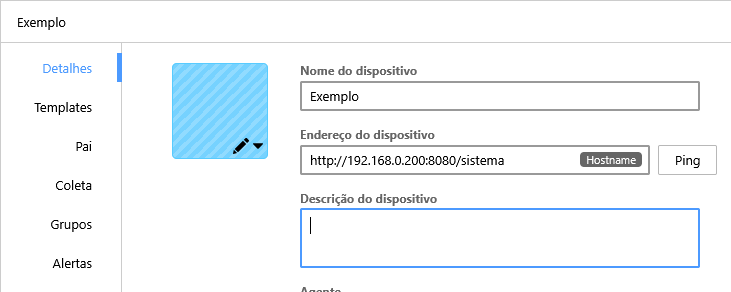
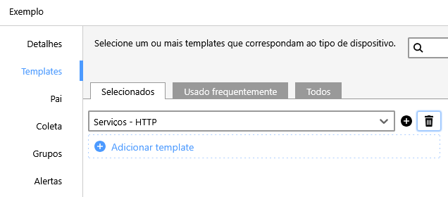
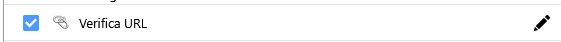
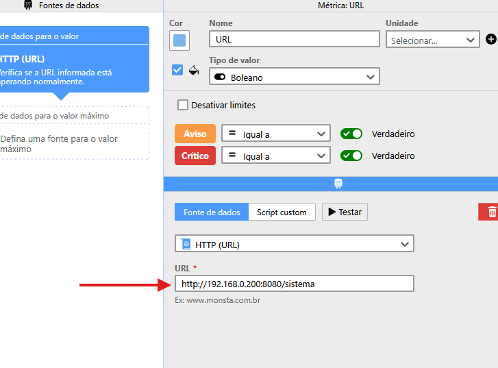

Este artigo explica o procedimento correto para monitorar o status de uma URL específica (como `http://192.168.0.200:8080/sistema`) no Monsta, verificando se está respondendo com um status HTTP/200 (OK).

## ❌ Erro Comum

É um erro comum tentar adicionar o caminho completo da URL (ex: `http://192.168.0.200:8080/sistema`) no campo Endereço do Dispositivo da tela do dispositivo.

O campo Endereço do Dispositivo aceita apenas o IP ou *hostname* (ex: `192.168.10.16`, `www.foo.com`). Ele é usado para identificar o dispositivo e não verifica caminhos de URL ou portas.

## ✅ Procedimento Correto: Utilizando o Monitor de URL

Para monitorar se um caminho específico em uma URL está respondendo corretamente, você deve adicionar um monitor dedicado a esse dispositivo.

### 1. Adicionar o Template de Serviço HTTP

- Edite o dispositivo.
- Adicione o template "Serviços - HTTP" ao dispositivo.  
    

### 2. Adicionar e Configurar o Monitor "Verifica URL"

O template "Serviços - HTTP" contém vários monitores, incluindo o Verifica URL, que será utilizado.

- Clique na opção para adicionar um novo monitor  
    
- Selecione o monitor "Verifica URL" e clique no ícone de lápis para editar  
    
- Clique em Avançado e adicione a URL que deseja monitorar (ex: `http://192.168.0.200:8080/sistema`) 
- Salve as alterações e crie o monitor

:::caution[Atenção]
O monitor Verifica URL (do template "Serviços - HTTP") só funciona para URLs que utilizam o protocolo HTTP. Se a sua URL for HTTPS (criptografada), entre em contato com o suporte para verificar se há algum monitor que verifique URLs HTTPS.
:::
