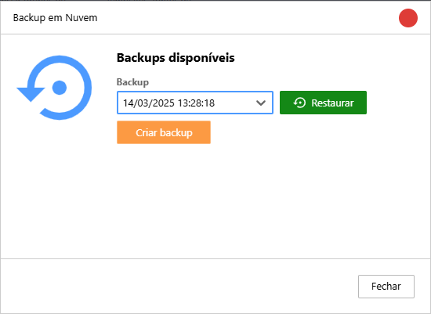

Este manual tem como objetivo instruir o usuário a restaurar um backup do Monsta.

## Restaurar umm backup da nuvem do Monsta

:::note
O Monsta necessita de acesso aos host `https://mind.monsta.com.br` e `https://store.monsta.com.br` para efetuar e restaurar backups.
:::

O Monsta efetua um backup automático das suas configurações em nossa nuvem diariamente caso existam modificações e mantém um histórico de até 10 backups.

:::caution[Atenção]
Alterações de status de dispositivos ou monitores não são consideradas mudanças de configuração.
:::

### Vantagens e desvantagens desse método

| Vantagens | Desvantagens |
| --- | --- |
| • Restauração leva poucos minutos; • Não é necessário conhecimento técnico em Linux. | • Histórico existente dos monitores são reiniciados quando restaurado em uma nova instalação. |

### Restaurar o backup

Para restaurar um backup da nuvem, execute os seguinte passos:

1. Acesse o Monsta utilizando um usuário com permissões de administrador;
2. Clique no menu “Configuração”;
3. Clique na opção “Backup em Nuvem”;
4. Selecione a data do backup que deseja restaurar;
5. Clique no botão “Restaurar”.  
    

Em alguns minutos, o Monsta será restaurado com as configurações do backup selecionado e solicitará o login novamente. Utilize usuários e senhas que estavam cadastrados nesse backup para logar.

## Restaurar um backup de um servidor

Utilize este método para manter o histórico dos monitores em uma nova instalação.

### Vantagens e desvantagens

| Vantagens | Desvantagens |
| --- | --- |
| • Histórico dos monitores é mantido. | • O tempo de restauração depende da quantidade de dados armazenada nos bancos de dados;   
• É necessário conhecimento técnico em shell do Linux. |

### Efetuar o backup do servidor atual

Para este procedimento, sugerimos que utilize o tutorial disponível em [Migração para outro servidor](/pt-br/start/migracao/migracao-para-um-novo-servidor) desta wiki pois o mesmo transferirá automaticamente o Monsta para um novo servidor.

