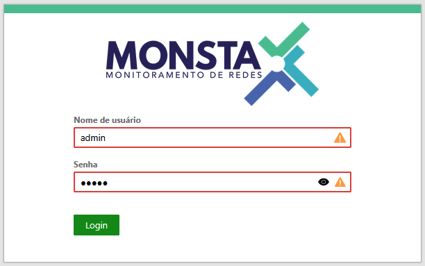

Este artigo tem como objetivo explicar como resolver o erro de login do Monsta, pois o problema pode ser ocasionado por causas distintas.



## Causas prováveis

A principal causa de erro ao realizar o login no Monsta é a senha incorreta. Caso você já tenha revisado a senha, antes de resetar a senha do usuário admin, há mais uma verificação que pode ser feita.

Quando o espaço disponível na partição onde está o banco de dados do Monsta se esgota, o sistema pode parar de funcionar corretamente. Você pode verificar o espaço disponível no seu Linux. Se estiver sem espaço, você encontrou o problema.

Para solucionar, primeiro verifique se o diretório do Monsta (`/var/monsta`) é o responsável por consumir todo o espaço (veja os comandos no item a seguir - [Como verificar o espaço disponível?](#como-verificar-o-espaço-disponível)). Se for esse o caso, será necessário aumentar o espaço disponível (caso a partição utilize **LVM**, você pode seguir o artigo [LVM - Aumentar Uma Partição](/pt-br/extra/linux/lvm-aumentar-uma-particao)) ou [migrar para um novo servidor](/pt-br/start/migracao/migracao-para-um-novo-servidor) com maior capacidade de armazenamento.

Se o diretório `/var/monsta` não estiver ocupando todo o espaço, verifique quais arquivos estão consumindo o armazenamento (logs, arquivos temporários, etc.) e exclua-os, se possível. Caso não seja possível removê-los, será necessário aumentar o espaço disponível no servidor.

Se você verificou o espaço disponível e não identificou problemas relacionados a armazenamento, tente [resetar a senha do usuário admin](/pt-br/tech/tutoriais-monsta/reset-da-senha-do-usuario-admin).


:::tip
Em muitos casos, o Linux onde o Monsta está instalado não faz parte do monitoramento. Por esse motivo, a partição pode encher sem que você perceba. Recomendamos fortemente que você monitore o espaço em disco desse servidor, a fim de acompanhar sua utilização. Para configurar o SNMP no Linux do Monsta, consulte o artigo de [Configurando o SNMP no Linux](/pt-br/extra/linux/snmp-linux).
:::


## Como verificar o espaço disponível?


:::caution[Atenção]
É necessário ter acesso ao Linux onde o Monsta está instalado para realizar o procedimento a seguir.
:::


Abaixo estão alguns comandos que permitem verificar o espaço em disco atual e identificar quais diretórios estão consumindo mais armazenamento.

```shell
# df -h
Sist. Arq.               Tam. Usado Disp. Uso% Montado em
/dev/mapper/fedora-root   30G  2,6G   28G   9% /
devtmpfs                 4,0M     0  4,0M   0% /dev
tmpfs                    2,0G     0  2,0G   0% /dev/shm
tmpfs                    782M  776K  781M   1% /run
tmpfs                    1,0M     0  1,0M   0% /run/credentials/systemd-journald.service
tmpfs                    1,0M     0  1,0M   0% /run/credentials/systemd-network-generator.service
tmpfs                    1,0M     0  1,0M   0% /run/credentials/systemd-udev-load-credentials.service
tmpfs                    1,0M     0  1,0M   0% /run/credentials/systemd-tmpfiles-setup-dev-early.service
tmpfs                    1,0M     0  1,0M   0% /run/credentials/systemd-sysctl.service
tmpfs                    1,0M     0  1,0M   0% /run/credentials/systemd-tmpfiles-setup-dev.service
tmpfs                    1,0M     0  1,0M   0% /run/credentials/systemd-vconsole-setup.service
tmpfs                    2,0G  828K  2,0G   1% /tmp
/dev/vda2                2,0G  270M  1,7G  14% /boot
/dev/mapper/fedora-var   366G  175G  192G  48% /var
tmpfs                    1,0M     0  1,0M   0% /run/credentials/systemd-tmpfiles-setup.service
tmpfs                    1,0M     0  1,0M   0% /run/credentials/systemd-resolved.service
tmpfs                    1,0M     0  1,0M   0% /run/credentials/getty@tty1.service
tmpfs                    391M   12K  391M   1% /run/user/0
```


:::note[Observação]
Os exemplos a seguir foram realizados em um Fedora Server. Dependendo da sua distribuição Linux, a estrutura pode ser diferente.
:::


No exemplo, observamos que o diretório `/var` está utilizando 48% do espaço da partição. O `/var` é o diretório onde está localizado o banco de dados do Monsta, portanto, ele não deve ficar sem espaço disponível.

Existem casos em que não há uma partição dedicada ao `/var`. Nessa situação, é necessário verificar o espaço disponível na partição raiz `/`.

```shell
# df -h
Sist. Arq.               Tam. Usado Disp. Uso% Montado em
/dev/mapper/fedora-root   40G  40G   0G   100% /
devtmpfs                 4,0M     0  4,0M   0% /dev
tmpfs                    2,0G     0  2,0G   0% /dev/shm
tmpfs                    782M  776K  781M   1% /run
tmpfs                    1,0M     0  1,0M   0% /run/credentials/systemd-journald.service
tmpfs                    1,0M     0  1,0M   0% /run/credentials/systemd-network-generator.service
tmpfs                    1,0M     0  1,0M   0% /run/credentials/systemd-udev-load-credentials.service
tmpfs                    1,0M     0  1,0M   0% /run/credentials/systemd-tmpfiles-setup-dev-early.service
tmpfs                    1,0M     0  1,0M   0% /run/credentials/systemd-sysctl.service
tmpfs                    1,0M     0  1,0M   0% /run/credentials/systemd-tmpfiles-setup-dev.service
tmpfs                    1,0M     0  1,0M   0% /run/credentials/systemd-vconsole-setup.service
tmpfs                    2,0G  828K  2,0G   1% /tmp
tmpfs                    1,0M     0  1,0M   0% /run/credentials/systemd-tmpfiles-setup.service
tmpfs                    1,0M     0  1,0M   0% /run/credentials/systemd-resolved.service
tmpfs                    1,0M     0  1,0M   0% /run/credentials/getty@tty1.service
tmpfs                    391M   12K  391M   1% /run/user/0
```

No exemplo, a partição raiz `/` está cheia, o que pode causar falhas no funcionamento do sistema.

Também é possível identificar quais diretórios estão ocupando mais espaço. Para isso, utilize o comando:

`# du -sh /*`

Esse comando exibirá o tamanho de cada diretório dentro de `/`. Após identificar o diretório que mais consome espaço, repita o comando dentro dele para detalhar ainda mais o uso.

Normalmente, em servidores em que há apenas o Monsta instalado, o diretório com maior consumo será o `/var`, e dentro dele, o `/var/monsta`.

```shell
# du -sh /var/*
0       /var/adm
105M    /var/cache
0       /var/db
0       /var/empty
176M    /var/flow
0       /var/ftp
0       /var/games
0       /var/kerberos
43M     /var/lib
0       /var/local
0       /var/lock
3,0G    /var/log
0       /var/mail
164G    /var/monsta
0       /var/nis
0       /var/opt
0       /var/preserve
0       /var/run
0       /var/spool
4,0K    /var/tmp
520M    /var/www
0       /var/yp
```

Se o diretório `/var/monsta` estiver utilizando muito espaço, a melhor solução é aumentar a capacidade disponível (caso a partição utilize LVM, você pode seguir o artigo [LVM - Aumentar Uma Partição](/pt-br/extra/linux/lvm-aumentar-uma-particao)) ou [migrar para um novo servidor](/pt-br/start/migracao/migracao-para-um-novo-servidor) com maior capacidade de armazenamento.
