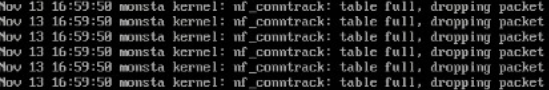

Este artigo demonstra como resolver o problema da perda intermitente de conexão ou pacotes que ocorre quando a tabela de rastreamento de conexões (*conntrack*) do kernel Linux está cheia.

## 1. Problema e Causas

O Linux usa o `nf_conntrack` (*Network Filter Connection Tracking*) para rastrear todas as conexões de rede ativas (TCP, UDP, ICMP etc.), necessário para o correto funcionamento do *firewall* (*iptables/nftables*) e do NAT (*Network Address Translation*).

Quando o número de conexões ativas atinge o limite máximo configurado, o *kernel* não consegue rastrear novas conexões e, por padrão, as descarta. Isso se manifesta como:

- Perda de conexão e pacotes no Linux.
- Falha intermitente para estabelecer novas conexões.
- Mensagens de erro no log do sistema (`/var/log/messages` ou `dmesg`), como: 
    - `kernel: nf_conntrack: table full, dropping packet`
    - `nf_conntrack: table full`



Esse problema influencia no monitoramento do Monsta, causando falha de coleta em monitores de forma aleatória, pois o Monsta envia a solicitação e não recebe uma resposta.

Motivos que podem causar o esgotamento da tabela:

1. **Alto Tráfego de Conexões de Curta Duração**: Servidores que lidam com muitas conexões que são abertas e fechadas rapidamente podem encher a tabela rapidamente. Uma grande quantidade de monitores no Monsta pode contribuir.
2. **Ataques de Negação de Serviço (DDoS/DoS)**: Um ataque de inundação de pacotes, especialmente *SYN floods* (que tentam abrir muitas conexões TCP incompletas), ou grandes volumes de tráfego UDP (que usa o *conntrack* para rastreamento básico) podem esgotar a tabela imediatamente.
3. **Timeouts Longos Demais**: Se o tempo que o kernel leva para "esquecer" uma conexão inativa (*timeout*) for muito longo, as entradas ficam presas na tabela, mesmo que a conexão tenha sido encerrada. Isso é especialmente problemático para conexões TCP no estado `TIME_WAIT` (o *timeout* padrão de 60 segundos é frequentemente longo demais para ambientes de alto tráfego).

## Como confirmar o problema

Você pode verificar o estado da tabela com os seguintes comandos:

```shell
# Limite máximo de conexões (nf_conntrack_max)
cat /proc/sys/net/netfilter/nf_conntrack_max

# Número atual de conexões ativas (nf_conntrack_count)
cat /proc/sys/net/netfilter/nf_conntrack_count
```

Se o `nf_conntrack_count` estiver muito próximo ou igual ao `nf_conntrack_max`, a tabela está cheia.

## 2. Solução: Aumentar e Otimizar os Limites 

A solução é aumentar o limite máximo de conexões (`nf_conntrack_max`) e otimizar os parâmetros de desempenho da tabela. Para alterar de forma permanente (sem perder as configurações ao reiniciar o Linux), siga os passos:

#### 2.1 Edite o arquivo configuração do sistema `/etc/sysctl.conf` com um editor de texto (`vi`, `nano`...)

```shell
vi /etc/sysctl.conf
```

#### 2.2 Adicione as seguintes linhas ao final do arquivo

```shell
######################################################
# Otimização de Conntrack para alto tráfego
######################################################
net.netfilter.nf_conntrack_max = 262144
net.netfilter.nf_conntrack_buckets = 65536
net.netfilter.nf_conntrack_tcp_timeout_time_wait = 30
```

#### 2.3 Salve e feche o arquivo

#### 2.4 Aplique as novas configurações sem precisar reiniciar o sistema

```shell
sysctl -p
```

## 3. Verificação

Após aplicar as alterações, verifique o novo limite.

```shell
cat /proc/sys/net/netfilter/nf_conntrack_max
# O resultado deve ser 262144
```
