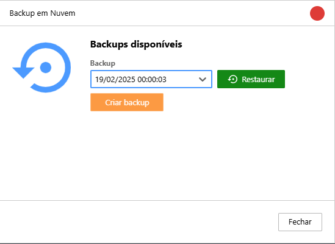
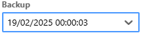

O Monsta possui um serviço em nuvem1 que efetua, automaticamente, um backup de suas configurações2 diariamente à 0h de cada dia, desde que hajam alterações nas configurações. Um total de 10 arquivos podem ser armazenados na nuvem.

:::caution[Importante]
1 O funcionamento deste recurso necessita, obrigatoriamente, que o software do Monsta possua comunicação com o host `mind.monsta.com.br` na porta **443/TCP**.  
  
2 O histórico dos monitores não é incluso neste backup.
:::

| Opção / Botão | Descrição |
| :---: | :--- |
|  | Lista dos backups disponíveis para restaurar. |
|  | Restaura o backup selecionado. Esse procedimento irá sobrepor todas as configurações atuais pelo backup selecionado. |
|  | Efetua um backup com a data de agora. |
