O Monsta Studio gerencia os mecanismos de coletas, alertas e ações do Monsta. As fontes disponibilizadas neste local estarão disponíveis para os dispositivos, monitores e grupos de alerta.

## Tela Inicial

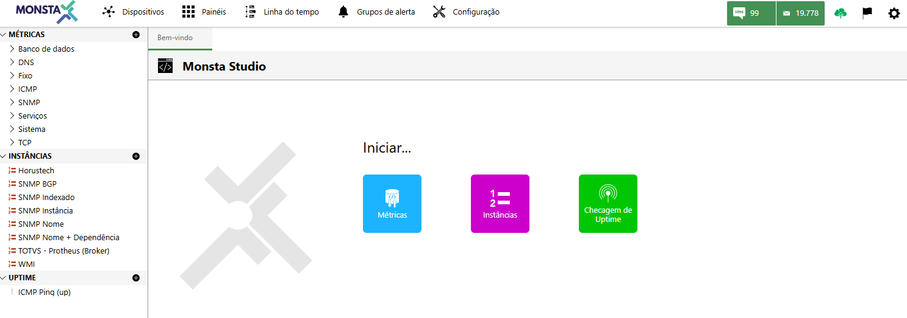

---

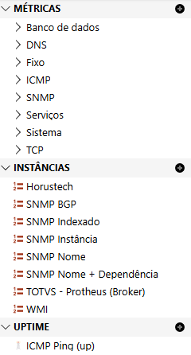
Listagem das fontes disponíveis e sua localização no Monsta. 

| Item | Descrição |
| :---: | :--- |
| Métricas | São as fontes utilizadas nas coletas de dados dos monitores. |
| Instâncias | São as fontes utilizadas na aba "Instâncias" durante a criação ou edição dos monitores. |
| Uptime | São as fontes utilizadas para checar o uptime durante a criação ou edição do dispositivo. |
| 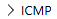 | Categoria da fonte. Utilizada para uma melhor organização da lista. |
| 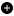 | Adiciona uma nova fonte de dados dentro da localização selecionada. | 

## Editor de Fontes

Nesta tela são criadas ou personalizadas as fontes de dados.

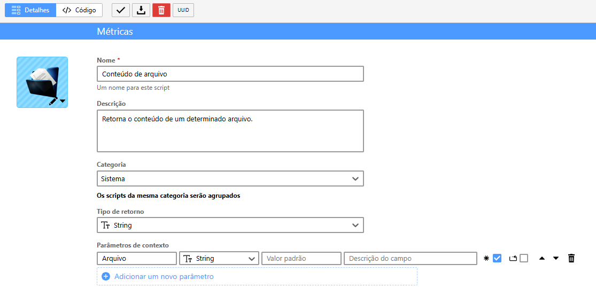

#### Detalhes

Exibe a tela para a edição de informações da fonte, como nomes e parâmetros.

| Opção / Ícone | Descrição |
| :---: | :--- |
|  | Seleciona um ícone para a fonte em evidência. |
| **Nome** | Informa um nome para a fonte. Esse nome é o que será mostrado nas listagens de fontes disponíveis. |
| **Descrição** | Breve comentário sobre o que faz a fonte. |
| **Categoria** | Informa em qual categoria a fonte se encontra. |
| **Tipo de Retorno** | Tipo de valor retornado ao final da execução da fonte. Pode ser um número, uma string, um texto, uma tabela, entre outros. |
| **Parâmetros** | São variáveis configuradas para serem utilizadas pelo código fonte da programação. É possível configurar um valor padrão para cada variável, assim como o usuário pode alterá-la durante a sua execução. |
| 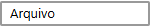 | Nome da variável. |
| 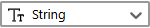 | Tipo de valor da variável. |
| 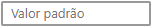 | Define um valor padrão para a variável. |
| 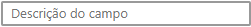 | Um comentário sobre a variável. Essa informação aparecerá quando o mouse estiver sobre o campo de valor durante a execução. |
| 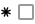 | Se marcado, a variável deverá ter um preenchimento obrigatório. |
| 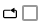 | Se marcado a variável poderá ser duplicada pelo usuário. |
| 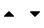 | Posição de exibição da variável na listagem. |
| 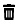 | Remove a variável selecionada. |

#### Código

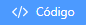
Nesta opção será apresentado o editor de código do Monsta. A linguagem de programação suportada será o LUA ([https://www.lua.org](https://www.lua.org/)). Para maiores informações sobre comandos e funções, consulte o [Scripting com LUA](/pt-br/tech/modulos-script/script-lua) ou [https://www.lua.org/manual/](https://www.lua.org/manual/). |

| Opção / Ícone | Descrição |
| :---: | :--- |
| 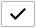 | Salva a edição de código atual. |
| 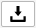 | Exporta a fonte em evidência para um arquivo. |
|  | Remove a fonte em evidência. Esse processo apenas é permitido se a mesma não estiver em uso. |
| 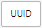 | Código de identificação da fonte para pesquisas. |
| 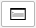 | Exibe as saídas e retorno do script quando executado. |
| 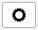 | Configura fonte e tamanho dos caracteres no editor de scripts. |
| 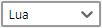 | Informa o tipo de linguagem utilizada pelo script. |
| 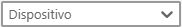 | Seleciona o dispositivo no qual será executado o teste do script. |
| 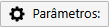 | Permite inserir valores nos parâmetros quando existentes. |
| 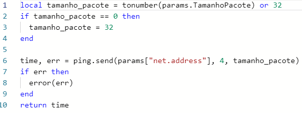 | Editor de código do Monsta. |
|  | Executa o script para fins de teste. |
