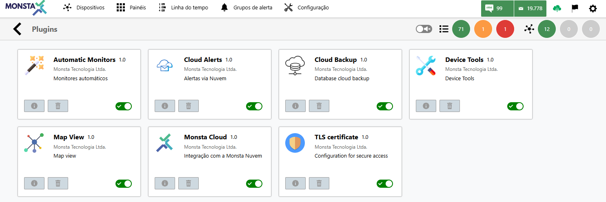

Na tela de plugins, você verá uma lista com todos os plugins disponíveis para cada tipo de assinatura. Cada plugin é acompanhado de uma breve descrição de sua funcionalidade e um botão para ativá-lo ou desativá-lo.

:::danger[Atenção]
Desativar plugins fará com que alguns recursos fiquem indisponíveis. Certifique-se de que você não os utiliza.
:::

