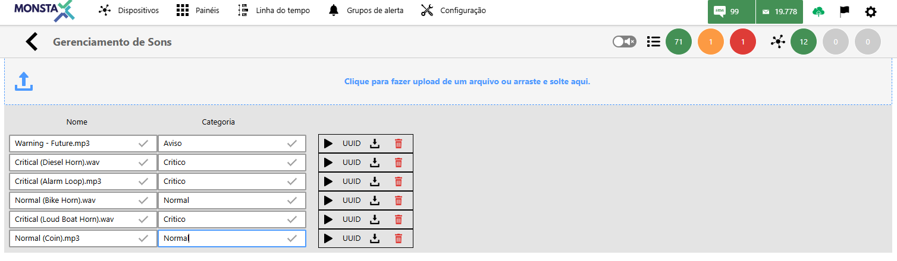
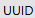

Gerencie a biblioteca de sons para seus alertas: faça upload e exclua o que não precisa mais.

| Ícone / Opção | Descrição |
| :---: | :--- |
|  | Efetua o upload de um arquivo para o banco de imagens. |
| Nome | Nome do arquivo de som. |
| Categoria | Define uma categoria ao som selecionado. |
|  | Executa o arquivo de som selecionado. |
|  | Informa o identificador da imagem selecionada. |
|  | Efetua o download de um arquivo. |
|  | Remove a imagem selecionada |