Template é o conjunto de recursos que podem ser monitorados em um dispositivo. Cada fabricante disponibiliza seus próprios recursos por equipamento.

## Templates

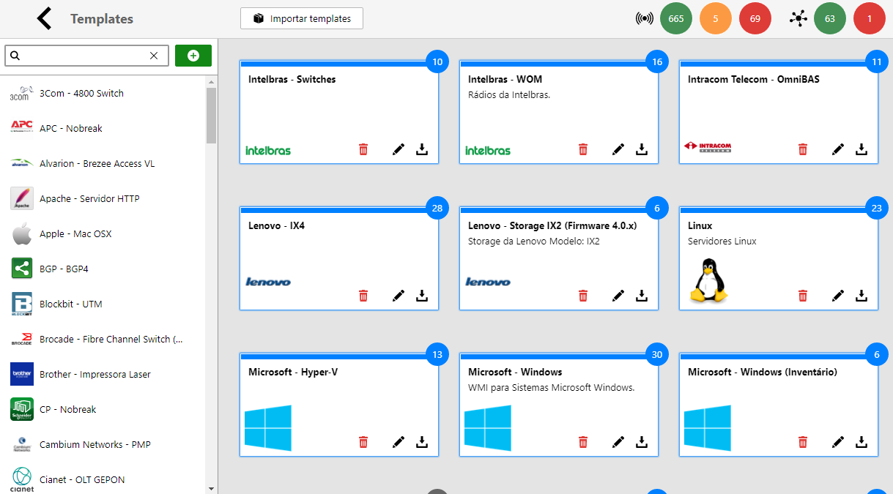

---

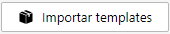
**Importar Templates**: Permite selecionar um arquivo de template para importar. 

---

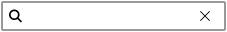
**Filtro de Pesquisa**: Quando utilizado, exibe apenas os templates que contém esse texto em seu nome.

---


**Novo Template**: Cria um novo template. Consulte [Criar/Editar um Template](#criareditar-um-template) para maiores informações.

---

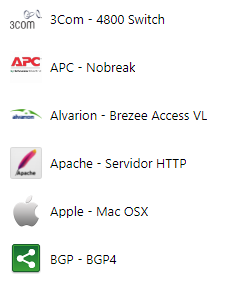
**Lista de Templates**: Apresenta uma lista com todos os templates disponíveis no sistema.

---

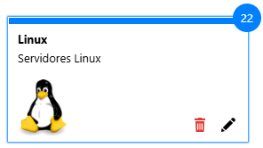
**Caixa de Template**: Apresentação visual do template. Ao clicar sobre ele o usuário é redirecionado para a tela de seus monitores. 

| Ícone | Descrição |
| :---: | :--- |
|  | **Remover**: Remove o template em evidência. |
| 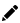 | **Editar**: Edita as propriedades do template, como nome, descrição e ícone. |

### Criar/Editar um Template

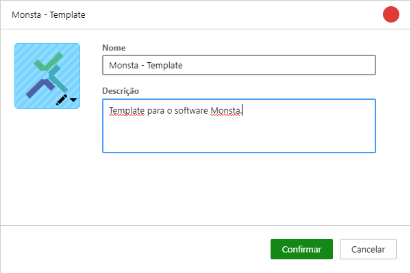

| Opção | Descrição |
| :---: | :--- |
|  | **Ícone do Template**: Permite selecionar um ícone para o template de uma biblioteca já existente ou a partir de uma nova imagem. |
| **Nome** | Nome dado ao template. |
| **Descrição** | Uma breve descrição sobre o template. |

## Monitores

Monitores são componentes do sistema que checam um determinado recurso em um dispositivo e retornam sua situação atual. São eles que geram informações e alertam sobre possíveis anomalias.

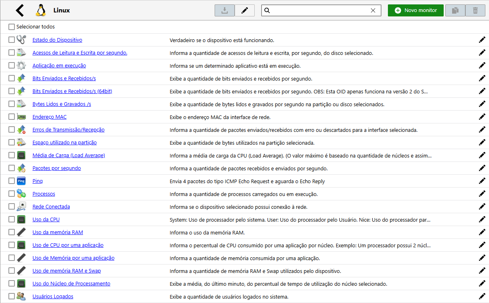

---

---

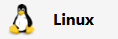
**Nome do Template**: Informa o nome do template em evidência.

---

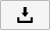
**Exportar**: Exporta os monitores selecionados para um arquivo.

---

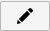
**Editar Template**: Edita as propriedades do template, como nome, descrição e ícone.

---

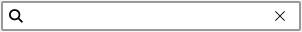
**Filtro de Pesquisa**: Quando utilizado, exibe apenas os monitores que contém esse texto em seu nome.

---

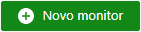
**Novo Monitor**: Cria um novo monitor para o template em evidência. Para maiores informações, consulte xxxxxxx.

---

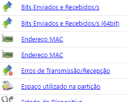
**Lista de Monitores**: Apresenta uma lista com todos os monitores disponíveis para o template em evidência. Clicar em um monitor permite editá-lo. 

| Ícone | Descrição |
| :---: | :--- |
| 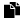 | **Clonar**: Clona o monitor para um template selecionado. |
|  | **Remover**: Remove o monitor selecionado. | 


### Criar/Editar um Monitor

#### Monitor

Nesta tela são configuradas informações básicas sobre o monitor.

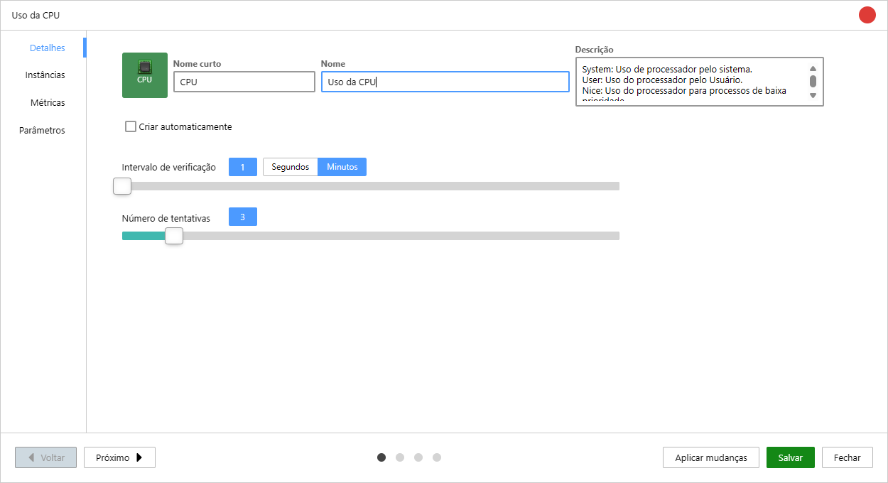

| Opção | Descrição |
| :---: | :--- |
| 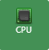 | **Ícone**: Permite selecionar um ícone para o template de uma biblioteca já existente ou a partir de uma nova imagem e também serve como prévia de como o monitor será exibido na tela. |
| **Nome Curto** | Informação sobre o monitor que é apresentada no ícone da tela de dispositivos. |
| **Nome** | Informação sobre o monitor que é apresentada na tela dos templates. |
| **Descrição** | É um breve informativo sobre o monitor. Esse texto será exibido ao passar ou mouse sobre os monitores de um dispositivo. |
| **Intervalo de Verificação** | Seleciona o tempo de checagem do monitor. <aside class="starlight-aside starlight-aside--caution">Caso esse valor seja maior que 59 segundos, quando uma métrica sai do estado normal o intervalo de verificação passará a ser, automaticamente, a cada 1 minuto.</aside> |
| **Número de Tentativas** | Número de checagens que serão feitas após o valor do monitor ultrapassar seu limite de normalidade para, posteriormente, trocar seu estado. |
| 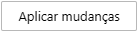 | Ao editar um monitor e clicar neste botão, o sistema permite replicar as alterações para outros dispositivos simultaneamente. Após clicar, selecione na lista os dispositivos que devem receber a nova configuração. |


#### Instâncias

Neste tela é informado o método de listagem das instâncias de um recurso, como por exemplo, a lista de interfaces de rede de um equipamento.

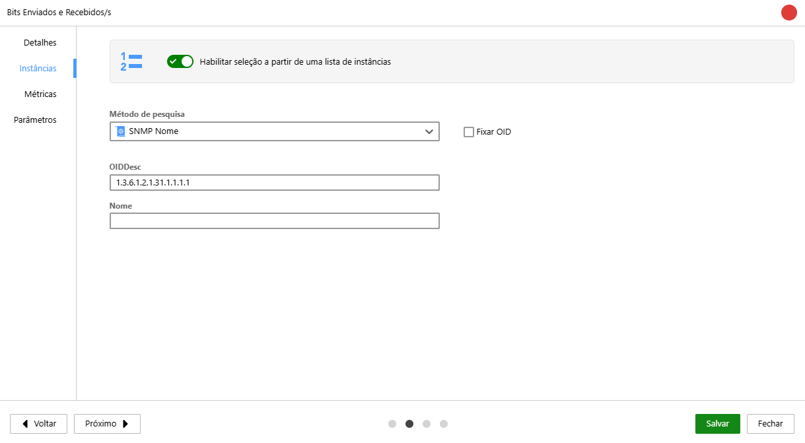

| Opção | Descrição |
| :---: | :--- |
| 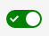 | **Ativar Instâncias**: Ativa a seleção de instâncias para o monitor. |
| 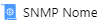 | Método de pesquisa utilizado para buscar as instâncias. |
| **Fixar OID** | Quando desabilitado, o Monsta verifica se o nome da instância continua na mesma OID. As seguintes situações podem ocorrer:<br />- **OID igual**: O Monsta coleta os valores na mesma posição;<br />- **OID diferente**: O Monsta descobre a nova OID e coletará os valores na nova posição;<br />Quando habilitada, o Monsta coletará as informações sempre na mesma posição, independente se a instância mudou de OID. |
| **OIDDesc e Nome** | Esta opção permite que o monitor identifique automaticamente múltiplos componentes de um mesmo dispositivo (como diferentes interfaces de rede, discos ou partições). O sistema utiliza scripts do **Monsta Studio** para listar esses itens. Nos parâmetros, você define as propriedades desejadas (como OIDs ou filtros) para extrair exatamente os dados que serão exibidos na listagem de seleção. |


### Métricas

Nesta tela são configurados a forma de coleta dos recursos do dispositivo.

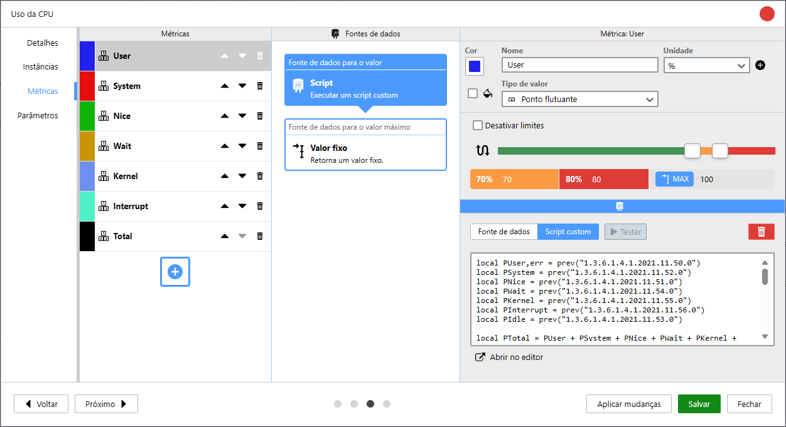

---

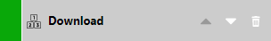
**Métrica**: Informa o nome da métrica e sua posição no gráfico. A métrica superior da lista tem seu gráfico sobreposto pela métrica inferior. 

| Ícone | Descrição |
| :---: | :--- |
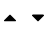 | **Ordenação**: Alterna a posição da métrica para ser impressa no gráfico. | 
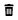 | **Remover**: Remove a métrica selecionada. | 

---


**Adicionar**: Adiciona uma nova métrica.

---

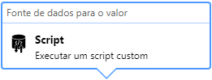
**Fonte de dados para o valor**: Configura a forma de coleta de dados da métrica. Esse é o valor que será impresso no gráfico.

---

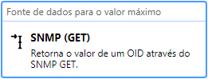
**Fonte de dados para o valor máximo**: Método para obtenção do valor máximo da métrica. Esse valor será utilizado para o cálculo do percentual que será utilizado nos limites de alerta.

---

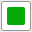
**Cor**: Cor da métrica que será apresentado ao acessar seu gráfico.

---

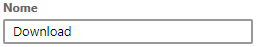
**Nome**: Nome da métrica que será apresentado ao acessar seu gráfico.

---

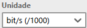
**Unidade**: Unidade de medida da métrica.

---

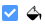
**Preencher**: Permite selecionar se a métrica deverá ter seu gráfico preenchido. Quando não selecionada esta opção o gráfico desta métrica irá apenas apresentar uma linha para as leituras.

---

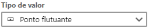
**Tipo de valor**: Informa o tipo de valor que a métrica retorna. A escolha dessa propriedade define o tipo de gráfico que será apresentado.

---

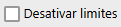
**Desativar limites**: Desativa os limites para a métrica. Ao ativar essa opção o estado da métrica sempre será "Normal" e a mesma nunca será alarmada.

---

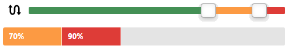
**Percentual de limites de alerta**: Em monitores que possuem um valor máximo definido, a barra percentual é exibida. Ela permite visualizar e definir rapidamente os limites definidos para os estados da métrica.

:::note
Disponível quando há um valor máximo configurado.
:::

| Opção | Descrição |
| :---: | :--- |
| 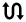 | **Inverter**: Inverte o percentual de alerta. Por padrão um valor menor será considerado melhor. |
| 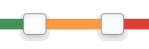 | **Barra de percentuais**:  Permite configurar visualmente os limites de alerta. Arraste os seletores para determinar os percentuais de uso que acionam os estados de "Aviso" e "Crítico". |
| 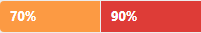 | **Valores dos percentuais**: Abaixo da barra de percentuais, o sistema exibe o valor numérico exato correspondente à posição dos marcadores. |

---

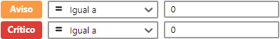
**Valores dos limites de alerta**: Em monitores sem um valor máximo pré-estabelecido, o usuário tem a liberdade de informar manualmente os valores numéricos para os estados de **Aviso** e **Crítico**.

:::note
Disponível quando não há valor máximo configurado.
:::

| Opção | Descrição |
| :---: | :--- |
|  | **Valor de Aviso**: Define a condição para a métrica entrar em estado de atenção. |
| 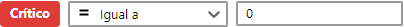 | **Valor de Crítico**: Define a condição para a métrica entrar em estado crítico. |

---


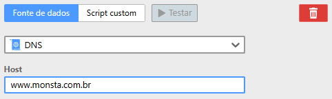
**Fonte de Dados**: Permite selecionar uma fonte de coleta existente e, se necessário, preencher os valores solicitados por ela.

| Opção | Descrição |
| :---: | :--- |
| 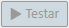 | **Botão Testar**: Testa a fonte contra um dispositivo selecionado. |
|  | **Botão Remover**: Remove a fonte de dados do valor em evidência. |
| **Coletor** | **Campo Coletor**: Seleciona o método que será utilizado para a coleta de dados do monitor. |
| **Parâmetros** | **Campo Parâmetros**: Permite informar os dados para os parâmetros selecionados. Parâmetros com um "\*" ao lado indicam que seu preenchimento ao adicionar um monitor será obrigatório. |

---

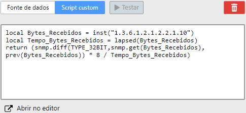
**Scripts Customizados**: Permite selecionar a fonte de dados da coleta. Nesta tela é possível utilizar scripts na linguagem LUA para as métricas.

| Opção | Descrição |
| :---: | :--- |
|  | **Botão Testar**: Testa o script contra um dispositivo selecionado. |
|  | **Botão Remover**: Remove a fonte de dados do valor em evidência. |
| **Abrir no Editor** | **Botão Abrir no editor**: Abre um editor avançado de desenvolvimento para o script. |

---

### Parâmetros

Nesta tela é possível criar parâmetros com valores pré-definidos para serem utilizados pelas fontes de dados das métricas. Essa opção é útil quando um monitor possui várias métricas que utilizem as mesmas informações, como um usuário e senha para autenticação, por exemplo.

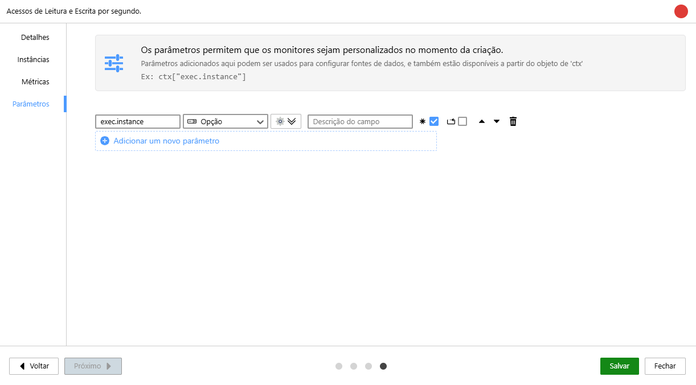

| Opção | Descrição |
| :---: | :--- |
| 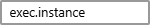 | **Nome**: Define um nome para o parâmetro. |
| 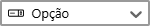 | **Tipo**: É o tipo de informação que o parâmetro deve receber. O tipo "Opção" trará uma lista vinda da aba "Instâncias". |
| 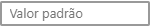 | **Valor padrão**: Define um valor padrão para o parâmetro ao criar o monitor. Essa opção não está disponível para o tipo "Opção". |
| 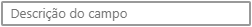 | **Descrição do campo**: É o texto que será informado ao usuário durante a adição de monitores aos dispositivos. |
| 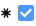 | **Opção de Campo Obrigatório**: Exige que o parâmetro tenha algum valor. Campos em branco não são permitidos. |
| 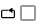 | **Opção de Campo que se repete**: Permite ao usuário inserir o mesmo campo várias vezes com valores diferentes. |
| 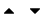 | **Posição**: Alterna a posição do parâmetro na listagem. |
|  | **Botão Remover**: Remove o parâmetro selecionado. |


:::caution[Importante]
Ao criar ou customizar um monitor, quando o tipo for uma opção e o método selecionado for "Scripts", o retorno deverá ser uma tabela com o seguinte formato:

`local ret = { display = "Texto", instanceId = "valor" }`

- Certifique-se de que o `instanceId` seja único (sem repetições).
- Nomeie a variável como `exec.instance`. Isso possibilita o reaproveitamento em **monitores automáticos** e a **clonagem de métricas**.
:::

:::danger[Atenção]
O uso obrigatório do nome de variável `exec.instance` é um pré-requisito para a automação. Caso outro nome seja utilizado, os **monitores automáticos não funcionarão corretamente** e a **clonagem de métricas ficará indisponível**.
:::

Exemplo:

```lua
local opts = {
    host = "192.168.1.1",
    username = "user",
    password = "password",
    command = "ls /backup/*.sql"
}
local ret = {}

local list = string.split(ssh.exec(opts),"\n")

for i, arq in pairs(list)
do
  local name = string.split(arq,"//")[2]
  table.insert(ret,{display=name,instanceId=i})
end

return ret
```