## Monitores

Os monitores são informações existentes em um equipamento, como CPU, memória, disco, etc. Cada equipamento disponibiliza recursos exclusivos que podem ser monitorados. As cores dos monitores variam conforme seu estado.

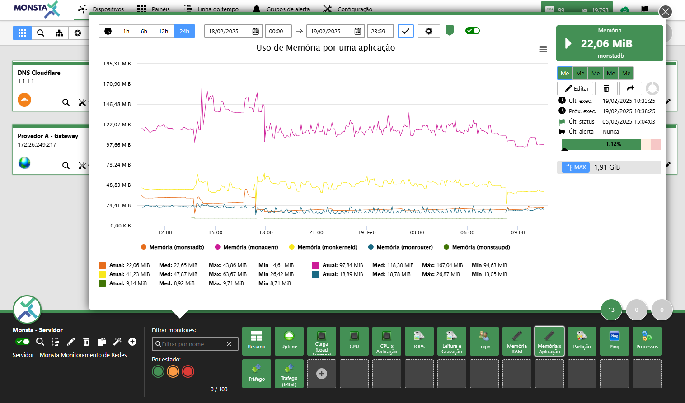

---

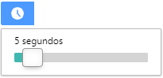
**Gráfico em tempo real**: Exibe o gráfico atualizando seus dados no intervalo de tempo selecionado. 

:::caution
Intervalos menores que o tempo de atualização dos dados do equipamento podem gerar gráficos com informações incorretas, tais como leituras zeradas ou picos acima do máximo permitido pelo equipamento.
:::

---

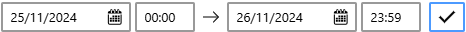 
 **Período de Amostragem**: Personaliza o período do gráfico a ser gerado. 

---

 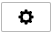 
 **Propriedades do Gráfico**: Abre a tela com as propriedades do gráfico exibido. 

| Ícone | Descrição |
| :---: | :--- |  
|  | **Título**: Nome que aparecerá no topo do gráfico. |
|  | **Limites por leitura**: Quando ativada, preenche todo o gráfico conforme o status do período durante as leituras. |
|  | **Mostrar Marcadores de Status**: Quando houver uma mudança de status no período de tempo apresentado, o Monsta adiciona uma marca para visualizar quando e para qual estado a mudança ocorreu. |
| 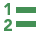 | **Ocultar valores**: Remove os valores informados da parte inferior da apresentação do gráfico. |
|  | **Ocultar legenda**: Remove a legenda da apresentação do gráfico. |
| 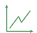 | **Mostrar apenas variação**: Renderiza o gráfico apenas com as suas variações para uma melhor visualização das mudanças. |
|  | **Cor da legenda**: Personaliza a cor do texto das legendas na parte inferior do gráfico. |
|  | **Cor de fundo**: Personaliza a cor de fundo do gráfico. |
|  | **Tamanho da fonte da legenda**: Personaliza o tamanho da legenda na parte inferior do gráfico. |
|  | **Largura da linha**: Personaliza a largura da linha renderizada no gráfico. |
| 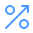 | **Mostrar Indicador de Percentil**: Adiciona ao gráfico o percentil selecionado. |
| **Agrupar Dados por Tempo** | **Agrupar os dados por tempo**: Quando há um período de tempo maior que dois dias o Monsta agrupa dados e gera uma média da informação automaticamente para ser apresentada no gráfico. Nessa propriedade é possível escolher o tempo que esse agrupamento irá utilizar ou simplesmente desativar essa propriedade. |

---

 **Valor da Métrica**:  Informa o nome da métrica, o valor da leitura atual e se o resultado está maior, menor ou igual à leitura anterior.

---

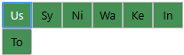 
**Métricas**: Exibe as informações sobre cada recurso individual monitorado. 

---

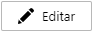 
**Editar**: Altera as propriedades do monitor selecionado. 

---

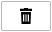 
**Excluir**: Excluir o monitor selecionado. 

---

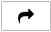 
**Publicar**: Cria um link para publicação do gráfico sem a necessidade de autenticação. Para maiores informações, consulte [Publicar um Monitor](#publicar-um-monitor)

---

 
**Número de Tentativas**: Informa a quantidade de tentativas do monitor antes de sair do estado normal. 

---

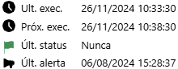 
**Informações do Monitor**: Exibe a data da última verificação, a data da próxima verificação, a última mudança de status e a data do último alerta enviado. 

---

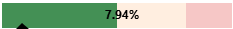 
**Percentual**: Exibe o percentual de recurso utilizado pela métrica selecionada quando há um valor máximo informado. 

---

 
**Exportar / Calcular Área**: O gráfico de coletas de informações oferece três opções principais para você interagir com os dados visualizados:

- **Exportar como Imagem**: No canto superior direito do gráfico, clique no ícone de "Download" ou "Exportar" para salvar o gráfico como um arquivo de imagem. Isso permite que você use a imagem em relatórios, apresentações ou compartilhe-a facilmente.
- **Exportar Dados**: Você pode exportar os dados brutos em formatos de planilha para análise posterior. Os formatos disponíveis são CSV e XLS.
- **Relatório de Consumo**: Para uma análise mais aprofundada, você pode calcular a área abaixo da curva do gráfico. Esta função é ideal para obter valores acumulados ou totais ao longo do período selecionado. Clique na opção "Relatório de Consumo" e o resultado será exibido em uma caixa de texto, pronta para ser copiada ou utilizada em seus cálculos.

### Publicar um Monitor

A publicação de um monitor permite que o usuário crie um link para acesso na internet sem a necessidade de um usuário e senha.

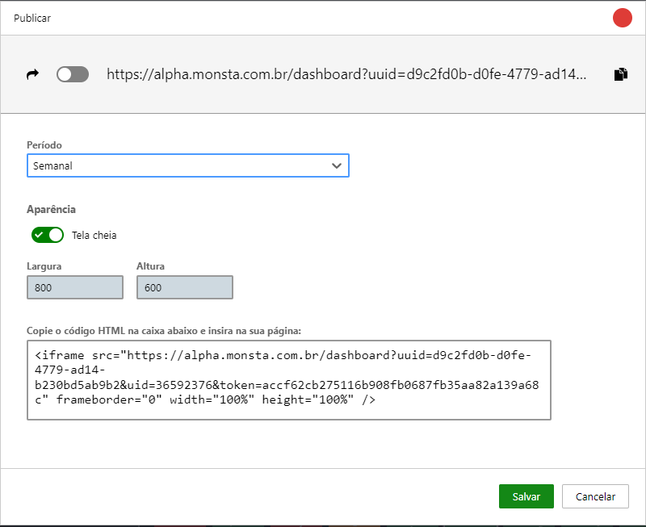
- **Publicar**: Habilita a criação do link para o monitor selecionado.
- **Período**: Permite escolher o tempo de publicação do gráfico. Por segurança, períodos maiores que um mês não são permitidos.
- **Tela cheia**: Quando ativado, utiliza toda a tela para exibir o gráfico.
- **Largura e Altura**: Define as dimensões do gráfico em pixels.
- **Código HTML**: Esse código é gerado pelo Monsta para o monitor selecionado e pode ser utilizado para publicar o gráfico em um painel de terceiros.

### Editar/Customizar um Monitor

A edição de um monitor permite customizar informações importantes sobre seu comportamento, como a frequência das coletas, limites de alerta e seu script de como buscar as informações.

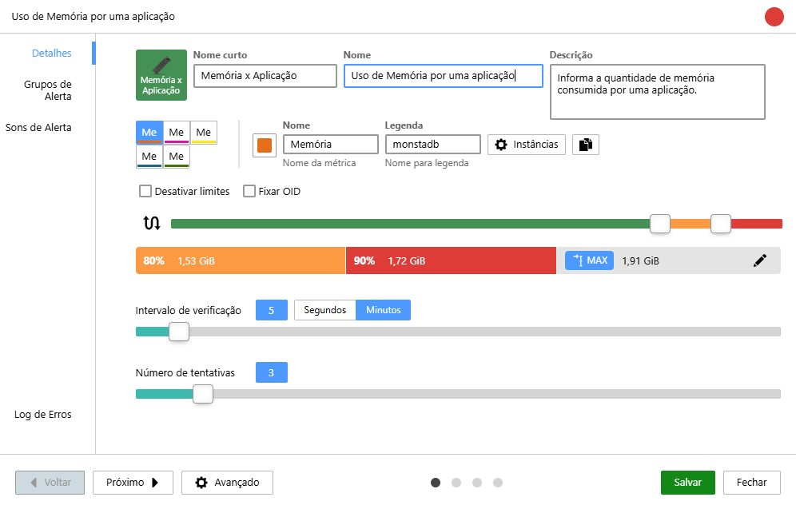

#### Detalhes

**Ícone**: Permite selecionar o ícone que será apresentado na tela. 

---

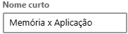
**Nome curto**: É o texto que aparecerá no ícone do monitor. 

---

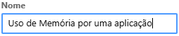
**Nome**: É o texto que será mostrado no topo do gráfico do monitor. 

---

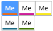
**Métricas**: São os recursos que terão seus dados coletados para o gráfico. 

---

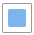
**Cor**: Seleciona a cor que será renderizada pela métrica no gráfico. 

---

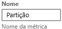
**Nome da métrica**: É o nome que será apresentado na legenda do indicador da leitura atual. 

---

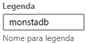
**Legenda**: É o nome que será apresentado na legenda do gráfico e no indicador de valor atual referente a métrica selecionada. 

---

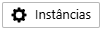
**Instâncias**: Permite trocar a instância atual da métrica. 

---

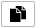
**Clonar**: Permite adicionar uma nova métrica ao mesmo monitor. 

---

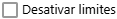
**Desativar Limites**: Quando marcado, desativa o envio de alertas para o monitor em edição. A métrica selecionada será considerada sempre em estado normal. 

---

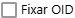
**Fixar OID**: Quando desmarcada, o Monsta verificará se o nome da instância monitorada continua na mesma OID e em caso de mudança, a nova posição será localizada de forma automática. Quando esta opção estiver marcada, o Monsta irá coletar dados sempre a mesma OID, independente do nome da instância. 

---

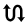
**Inversão da Lógica de Limite (Threshold Inversion)**: Esta opção permite que você altere a **lógica de alerta** de um monitor. Use esta funcionalidade para métricas onde um **valor baixo** indica um problema (ex: a velocidade de uma interface de rede não deve cair de um certo nível) ou onde você precisa monitorar faixas específicas de valores. 

---
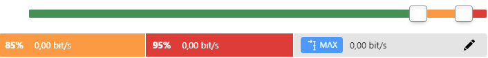
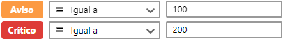
**Percentual para Alertas**: Permite selecionar em quais valores a métrica entrará em estado de alerta. Quando há um valor máximo definido, a configuração dos alertas será em percentual, caso contrário, os limites são informados textualmente. 

---

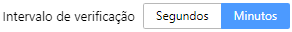
**Intervalo de Verificação**: Permite selecionar a frequência de tempo que o monitor será executado. 

---

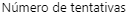
**Número de Tentativas**: Permite selecionar quantas vezes o monitor deverá ser checado antes de sair do seu estado normal. Quando um monitor retorna ao estado normal antes de atingir esse limite, esse contador é zerado. | 

---

#### Grupos de Alerta

**Notificar grupo de alerta**: Quando ativado, envia alertas para os grupos selecionados, caso contrário, o Monsta não enviará alertas mesmo quando o monitor trocar de status.

---

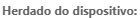
**Herdado do dispositivo**: São os grupos de alerta definidos na edição do dispositivo. Uma vez que são herdados, não é possível removê-los do monitor, apenas desativá-los.

---

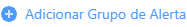
**Adicionar Grupo de Alerta**: Adiciona grupos que receberão os alertas quando o monitor trocar de estado. Para maiores informações consulte [Alertas](/pt-br/manual/grupos-alertas/alertas).

---

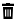
**Remover Grupo de Alerta**: Remove o grupo de alerta selecionado.

---

#### Sons de Alerta
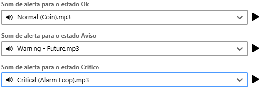
Permite adicionar sons de alerta personalizados para cada status do monitor.

---

#### Log de Erros
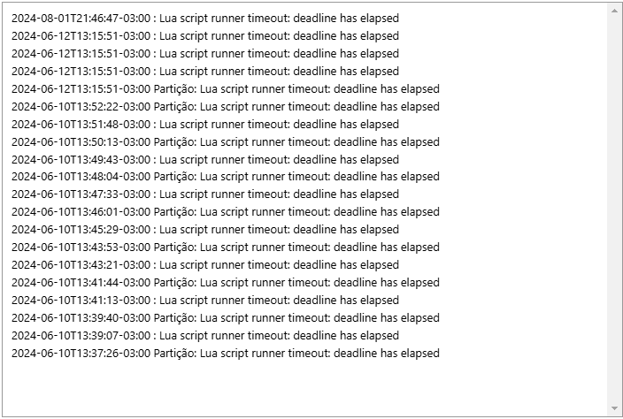
Informa as últimas falhas que ocorreram com a coleta do monitor. Esse registro é útil para saber o motivo de alguma coleta não estar sendo realizada com sucesso.

#### Avançado
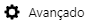

##### Métricas 

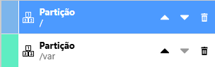
Métricas: Permite alterar a ordem de exibição da métrica, removê-la ou editá-la. Para maiores informações sobre como editar uma métrica consulte [Métricas](/pt-br/manual/configuracoes/templates#métricas). 

---

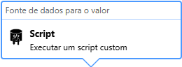 
Fonte de dados para o valor: É o método que o Monsta irá utilizar para coletar informações para essa métrica. Para maiores informações, consulte [Métricas](/pt-br/manual/configuracoes/templates#métricas). 

---

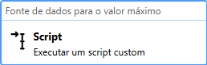
Fonte de dados para o valor máximo: Utilizado quando o monitor possui um valor máximo limite. Para maiores informações, consulte [Métricas](/pt-br/manual/configuracoes/templates#métricas). 

---

##### Parâmetros

Nessa aba serão informados os parâmetros utilizados pelo monitor selecionado e seus respectivos valores utilizados.