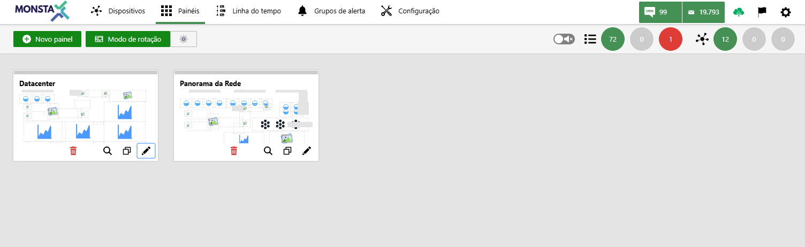

A aba "Painéis" é o seu centro de comando para visualizar de forma rápida e eficiente os indicadores mais importantes do seu sistema. Imagine um painel de um carro que exibe as informações vitais sobre o veículo.

**Crie painéis personalizados**: Organize seus widgets da forma que melhor atender às suas necessidades, agrupando indicadores relacionados para uma análise mais aprofundada.  
  
**Adicione e personalize widgets**: Escolha entre uma variedade de widgets para visualizar dados de diferentes fontes, como gráficos de linha, mapas, grupos, setas e muito mais. Personalize cada um com seus dados mais relevantes.  
  
**Arraste e solte**: Organize seus widgets com facilidade, arrastando-os para a posição desejada no painel.

## Criar painéis

**Novo Painel**: Adiciona um novo Painel

---

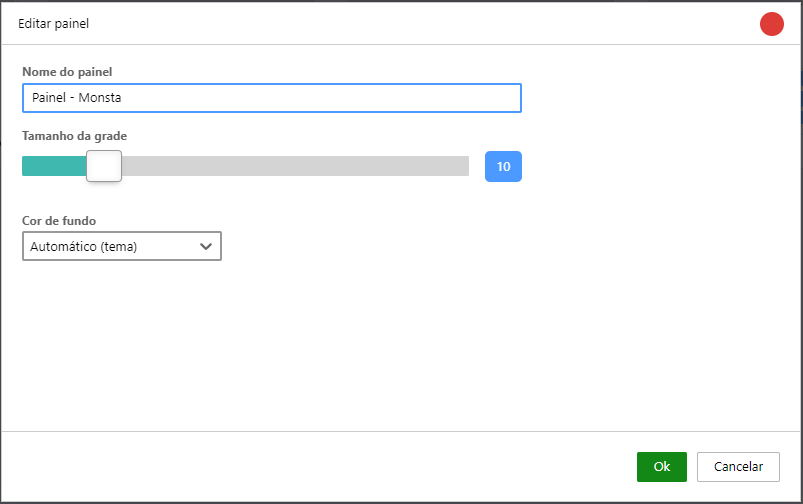
- **Nome do Painel**: Nesse campo deverá ser informado o nome do painel.
- **Tamanho da grade**: Essa opção permite estipular o espaçamento da grade que será utilizada como base para a inserção dos widgets.
- **Cor de fundo**: Permite selecionar a cor do fundo do painel. Quando utilizado o modo automático, o painel seguirá as configurações do [modo noturno](/pt-br/manual/barra-superior/recursos-disponiveis#ferramentas).

## Modo de Rotação

 
**Modo de rotação**: Quando há mais de um painel disponível você pode configurar o Monsta para rotacioná-los automaticamente. 

Através do botão é possível configurar o tempo, em minutos, que cada painel deverá permanecer em exibição assim como selecionar quais deverão estar ativos para exibição.

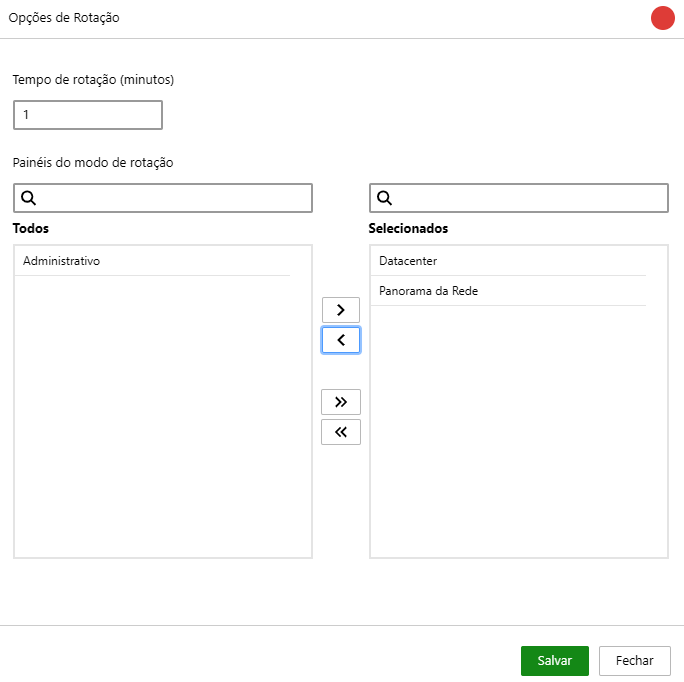

## Template do painel

Cada painel criado é mostrado na tela principal como um template. 

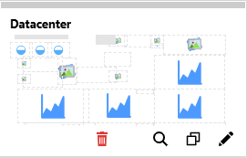

| Ícone | Descrição |
| :---: | :--- |
|  | **Excluir**: Remove o painel selecionado. |
| 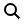 | **Visualizar**: Exibe o painel selecionado. |
|  | **Duplicar**: Cria uma cópia do painel e todos seus widgets. |
|  | **Editar**: Permite alterar as configurações do painel selecionado. |

## Edição do painel

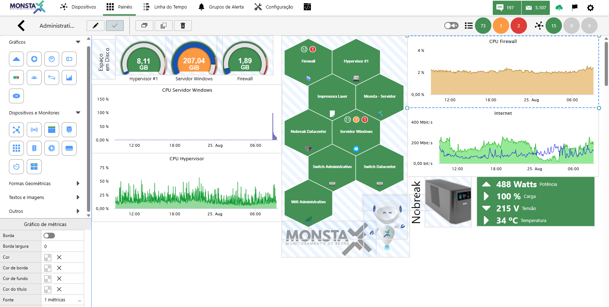

| Ícone | Descrição |
| :---: | :--- |
| 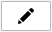 | **Editar Painel**: Utilize esse botão para editar as propriedades do painel atual. |
| 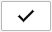 | **Salvar**: Salva as configurações do painel atual. |
| 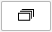 | **Duplicar**: Duplica o widget selecionado. |
| 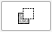 | **Dispor**: Move o widget selecionado para trás dos widgets existentes. |

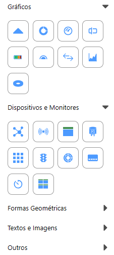
**Menu de Widgets**: O seu painel é totalmente customizável graças ao **Menu de Widgets** à esquerda. Este menu funciona como uma biblioteca de componentes, onde você pode encontrar e selecionar os mais diversos tipos de visualizações para o seu painel. Para montar seu painel, simplesmente navegue pelas categorias no menu, clique sobre o widget que deseja e clique sobre a área de trabalho para inserí-lo. A ordem e o posicionamento dos widgets podem ser ajustados a qualquer momento, permitindo que você crie um painel que atenda exatamente às suas necessidades.

---

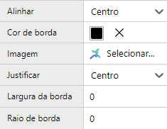
**Propriedades do Widget**: São as opções que podem ser alteradas para o widget selecionado. Dentro dessa tela são configurados os dispositivos e monitores que serão utilizados pelos widgets. |
