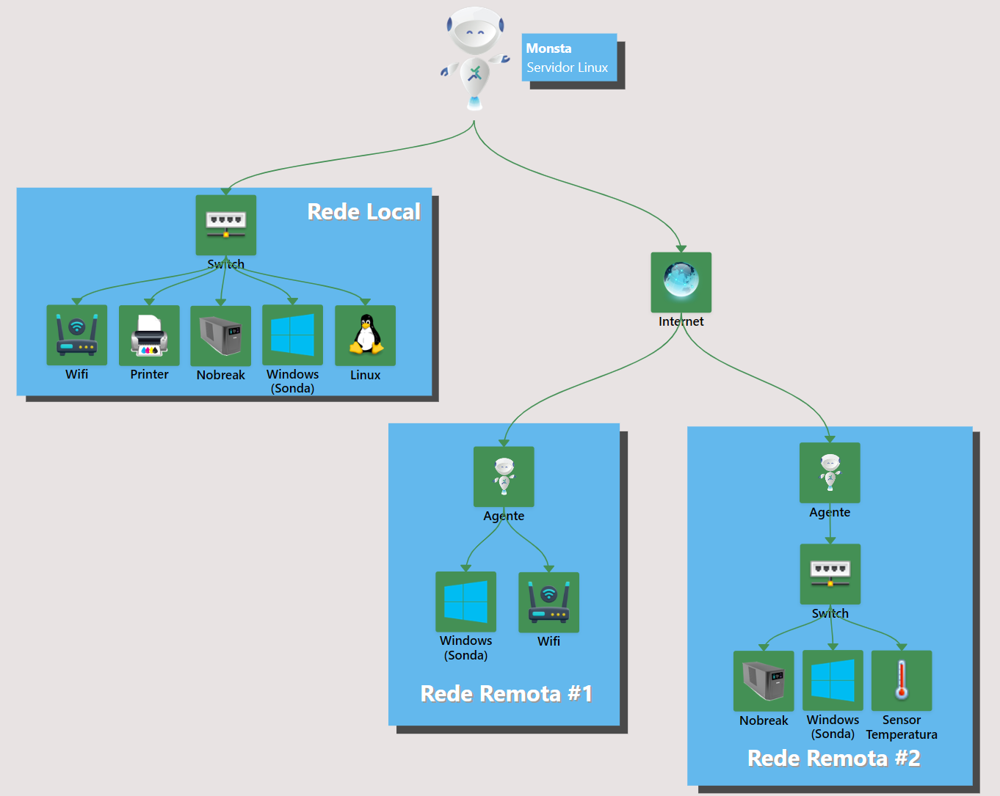

O Monsta, desenvolvido pela Monsta Tecnologia, é uma **plataforma de monitoramento de infraestrutura de Tecnologia da Informação (TI)** projetada para oferecer uma visão abrangente e em tempo real da saúde e do desempenho de diversos componentes de um ambiente de TI. Ele permite que empresas e profissionais de TI identifiquem, diagnostiquem e resolvam problemas de infraestrutura de forma proativa, garantindo a continuidade dos serviços e a otimização dos recursos.

**Principais Características e Funcionalidades**:

* **Painéis Gráficos Intuitivos e Dinâmicos**: A plataforma oferece painéis de visualização personalizáveis que apresentam métricas e informações cruciais de forma clara e de fácil interpretação. Esses painéis podem ser adaptados para exibir dados específicos relevantes para diferentes áreas da infraestrutura.
* **Monitoramento em Tempo Real**: O Monsta coleta e exibe dados de desempenho em tempo real, permitindo que os usuários acompanhem a atividade e o status dos seus sistemas no momento exato em que ocorrem eventos.
* **Detecção Precisa de Problemas**: Através de configurações de limiares e alertas inteligentes, o Monsta é capaz de identificar anomalias e potenciais problemas de desempenho antes que eles causem interrupções significativas.
* **Alertas e Notificações**: O sistema de alertas notifica os usuários por meio de canais tais como SMS, e-mail e Telegram, sobre eventos críticos ou que exigem atenção, permitindo uma resposta rápida e eficiente.
* **Backup Automático na Nuvem**: O Monsta oferece a funcionalidade de backup automático de configurações e dados de monitoramento na nuvem, garantindo a segurança e a disponibilidade dessas informações em caso de falhas locais.
* **Monitoramento de Dispositivos e Serviços**: A plataforma é escalável e capaz de monitorar uma ampla gama de dispositivos de infraestrutura (servidores, redes, firewalls, etc.) e serviços (aplicações, bancos de dados, websites, etc.), com a possibilidade de monitorar um número ilimitado de itens dependendo do plano contratado.
* **Monitoramento de Redes Remotas via Agentes**: O Monsta permite expandir a visibilidade da infraestrutura para além da rede local, alcançando unidades remotas, clientes externos ou ambientes de nuvem de forma segura e simplificada através de seus agentes.

#### Exemplo de uma estrutura de rede monitorada pelo Monsta

