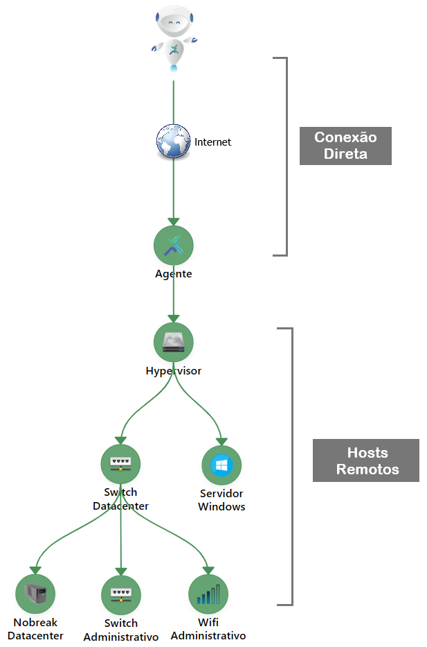
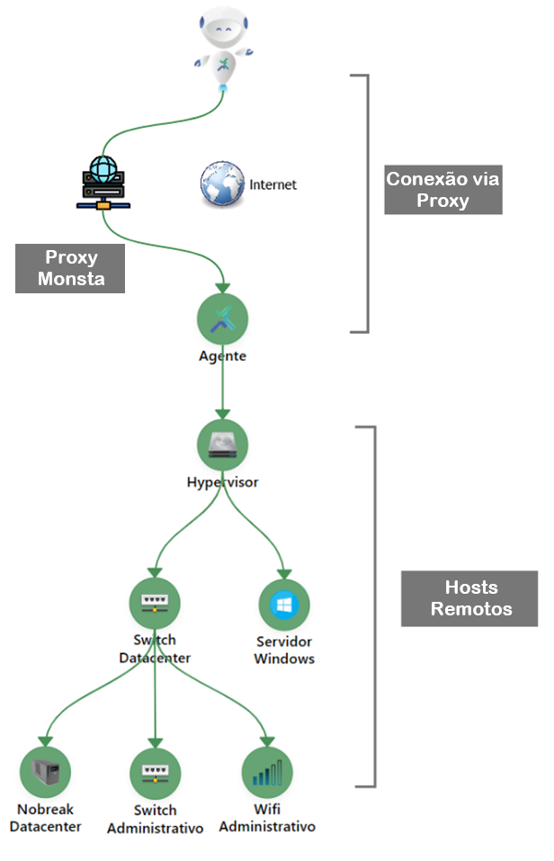

O **Agente Monsta** é um software instalado diretamente nos dispositivos (End-points) para permitir a coleta de métricas internas e o monitoramento de redes geograficamente distribuídas. Sua principal função é atuar como um túnel de dados seguro, eliminando a dependência de infraestruturas de rede complexas, como **VPNs**.

## Instalação

A instalação do agente foi desenvolvida para ser Zero Conf. Isso significa que o software foi projetado para funcionar imediatamente após a instalação, sem que o usuário precise realizar ajustes manuais.

**Passo a passo para instalação**:

1. **Download**: Acesse a página oficial de [Downloads do Monsta](https://www.monsta.com.br/downloads) e baixe a versão compatível com seu sistema operacional.
2. **Execução**: Execute o instalador no servidor ou estação de trabalho que deseja utilizar como ponto principal.
3. **Vinculação**: Ao ser solicitado, informe a **Chave de Licença** do seu servidor Monsta para estabelecer a comunicação criptografada. A chave pode ser obtida no menu **Configuração -> Agentes**.

Uma vez conectado, o dispositivo aparecerá automaticamente no menu de dispositivos para configuração dos monitores. Para monitorar dispositivos da rede remota, basta adicioná-los na hierarquia abaixo do agente.

## Conexão

O Agente Monsta oferece flexibilidade na forma como se comunica com o Servidor Monsta , permitindo a conexão de duas maneiras: **Direta** ou via **Servidores Proxy** da nossa plataforma. Isso é definido automaticamente pelo protocolo durante o processo de comunicação.

### Direta (Recomendada)

A conexão direta é o método de comunicação **padrão e mais eficiente** para o Agente Monsta.

#### Como Funciona

Neste modo, o Agente, instalado na rede remota, estabelece uma **comunicação ponto a ponto** segura (usando o protocolo QUIC) diretamente com o Servidor Monsta.

- **Fluxo**: Agente Remoto -> Internet/WAN -> Servidor Monsta.
- **Requisito**: O Servidor do Monsta deve ter a porta de comunicação **58580/UDP (saída)** disponível para a internet.

#### Vantagens (Por que é a Melhor Opção?)

| **Vantagem** | **Descrição** |
| --- | --- |
| **Performance Pura** | O tráfego de métricas percorre o caminho mais curto possível, resultando na **menor latência** e maior velocidade de resposta para a detecção de eventos. |
| **Segurança Simples** | O túnel QUIC criptografa a comunicação **de ponta a ponta**, sem intermediários, garantindo que apenas o Servidor Monsta possa descriptografar os dados. |
| **Maior Resiliência** | O QUIC é otimizado para lidar com perda de pacotes e mudanças de rede. Em conexões diretas, sua resiliência é máxima, garantindo menos desconexões. |
| **Menos Pontos de Falha** | A ausência de um servidor intermediário significa que há apenas dois pontos a serem gerenciados (Agente e Servidor Monsta), reduzindo a complexidade e os potenciais gargalos. |

### Conexão Via Servidores Proxy da Plataforma Monsta

Esta opção é oferecida para ambientes com restrições de rede, onde o Servidor Monsta não possui comunicação na porta 58580/UDP para a internet.

#### Como Funciona

Neste modo, o Agente se conecta a um dos servidores proxy mantidos pela nossa plataforma. Este servidor intermediário recebe o tráfego do agente e o encaminha para o Servidor Monsta.

- **Fluxo**: Agente Remoto -> Internet/WAN -> Servidor Proxy Monsta -> Servidor Monsta Principal.

#### Desvantagens e o Porquê de Evitar (Se Possível)

Embora ofereça flexibilidade, a utilização de um proxy deve ser considerada apenas em último caso devido às seguintes desvantagens em comparação com a Conexão Direta:

| **Desvantagem** | **Impacto** |
| --- | --- |
| **Aumento de Latência** | O tráfego precisa passar por um nó intermediário adicional. Isso **aumenta o tempo de resposta** e pode atrasar a detecção de falhas críticas. |
| **Potencial Gargalo** | O servidor proxy pode se tornar um gargalo de desempenho se muitos agentes estiverem conectados simultaneamente, sobrecarregando o processamento de tráfego. |
| **Mais Pontos de Falha** | Adicionar um servidor intermediário aumenta o número de componentes que podem falhar, afetando a estabilidade da sua monitoração. |
| **Dificuldade no Troubleshooting** | A complexidade do caminho da rede é maior, dificultando a identificação de onde um problema de conexão ou latência está ocorrendo. |

## Compatibilidade com NAT e IPs Dinâmicos

O **Agente Monsta** foi arquitetado especificamente para superar desafios comuns em redes remotas, como o uso de NAT (tradutor de endereço de rede) e a atribuição de endereços IP dinâmicos.

### Funcionamento em Ambientes com NAT

O NAT é a tecnologia que permite a múltiplos dispositivos em uma rede local (que possuem IPs privados, como `192.168.x.x`) compartilharem um único endereço IP público.

- **Problema Tradicional**: Ferramentas que tentam iniciar a conexão de fora (do servidor central para o dispositivo remoto) falham, pois o NAT bloqueia a conexão de entrada (inbound) e o endereço privado não é roteável.
- **Solução da Monsta**: O Agente Monsta sempre **inicia a conexão de dentro da rede remota** (o host do Agente) para o Servidor Monsta (que tem um IP conhecido em nossa nuvem).
    
    Este método de **"conexão de saída"** (*outbound*) permite que o Agente "atravesse" o *firewall* e o NAT da rede remota sem a necessidade de configurações complexas como *Port Forwarding* (redirecionamento de portas).

### Tolerância a IPs Dinâmicos

Redes remotas residenciais ou pequenas filiais frequentemente utilizam endereços IP públicos que mudam periodicamente (IP Dinâmico), fornecidos pelo provedor de internet.

- **Protocolo QUIC**: O sucesso do agente em lidar com IPs dinâmicos é garantido pelo uso do protocolo **QUIC**.
- **ID de Conexão**: Diferente do TCP, que identifica a conexão pelo par IP:Porta, o QUIC usa um **ID de Conexão Único**. Se o Agente Monsta estiver ativo e o endereço IP público de sua rede mudar:
        
    1. O Servidor Monsta Principal não encerra a sessão.
    2. O agente simplesmente retoma o envio de dados usando o novo endereço IP público.

Isso significa que, mesmo que o IP da sua filial mude, a conexão segura do Agente Connect é mantida, garantindo um **monitoramento contínuo e ininterrupto**.

## Cache de Dados

### Visão Geral

O recurso de **Cache de Dados** garante que o monitoramento de redes remotas permaneça ininterrupto e completo, mesmo durante falhas ou interrupções na comunicação com o servidor principal do Monsta.

O Agente remoto inclui um mecanismo de **Cache** que armazena localmente todas as métricas coletadas enquanto a conexão estiver indisponível. Isso elimina a perda de dados críticos e assegura a integridade histórica do monitoramento.

### Mecanismo de Funcionamento

O processo de cache opera da seguinte forma:

1. **Detecção de Falha**: O Agente monitora ativamente a conectividade com o servidor Monsta. Ao detectar uma falha na comunicação (ex: timeout, erro de rede), o Agente grava automaticamente os dados no cache da máquina local.
2. **Armazenamento em Cache**: Durante o período de desconexão, todas as métricas de rede (tráfego, latência, status de dispositivos, etc.) são coletadas normalmente e armazenadas em uma fila persistente no disco local do Agente.
3. **Sincronização (Reconexão)**: Assim que a comunicação com o servidor Monsta é restabelecida, o Agente inicia automaticamente a **Sincronização**. Os dados armazenados em cache são transmitidos ao servidor, respeitando a ordem cronológica original. Após o envio bem-sucedido, os dados são removidos do cache local.

## Quando Utilizar o Agente

O **Agente do Monsta** foi desenvolvido para superar as limitações impostas por arquiteturas de rede complexas e distribuídas. Ele atua como um coletor de dados inteligente, permitindo um monitoramento abrangente e eficiente em diversas situações, como as destacadas abaixo:

### Monitoramento de Redes Remotas (Sem VPN)

O Agente elimina a necessidade de configurar e manter complexas Redes Virtuais Privadas (VPNs) ou soluções de túnel para monitorar ambientes externos de forma simples e segura.

### Monitoramento em Ambientes com Restrição de Portas (Sem Redirecionamento)

Em ambientes com políticas de segurança rígidas (como data centers de clientes ou redes altamente segmentadas), muitas vezes não é possível abrir ou redirecionar portas para que o servidor do Monsta acesse diretamente os dispositivos. O Agente não necessita de redirecionamento de portas.

### Monitoramento de redes com a mesma faixa de endereços

Um dos grandes diferenciais do Agente Monsta é a capacidade de monitorar diferentes clientes ou unidades que utilizam a mesma faixa de endereçamento IP (ex: `10.0.0.0/16`) sem qualquer conflito.

### Distribuição Inteligente do Processamento de Coletas

Para grandes infraestruturas com milhares de itens sendo monitorados, o Agente permite descentralizar a carga de trabalho de coleta de dados do servidor principal. Ao distribuir as tarefas de coleta por múltiplos Agentes, você garante que o servidor do Monsta se concentre apenas no armazenamento e visualização, permitindo que o sistema escale horizontalmente o processamento.