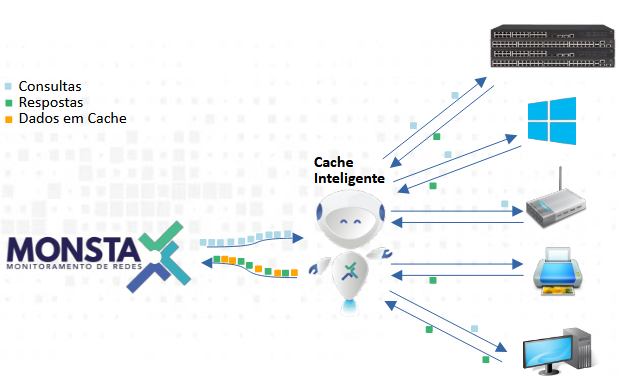

O Monsta emprega um sistema de **cache inteligente de requisições de instâncias** para otimizar o monitoramento de rede, reduzindo significativamente o consumo de banda e o uso de recursos computacionais tanto no dispositivo monitorado quanto no servidor onde o Monsta está hospedado. Este mecanismo opera identificando e armazenando dados de requisições previamente consultadas, evitando a necessidade de novas solicitações para informações já conhecidas.

## Funcionamento Técnico

O processo de cache inteligente pode ser detalhado nas seguintes etapas:

1. **Interceptação da Requisição**: Quando um monitor inicia uma requisição para obter informações de um dispositivo de rede (por exemplo, velocidade de uma porta, memória total, lista de instâncias, etc.), a requisição é primeiro interceptada pelo módulo de cache inteligente.
2. **Validação das instâncias**: O Monsta utiliza uma técnica para validar se houve modificação das propriedades da instância requisitada: 
    1. Quando existem alterações, o cache é marcado como expirado e uma nova consulta é efetuada;
    2. Se não existem alterações, a consulta será encaminhada ao cache.
3. **Verificação do Cache**: Antes de encaminhar a requisição ao dispositivo monitorado, o módulo de cache verifica se a instância solicitada já existe em seu **repositório de cache local**. Essa verificação é baseada em um identificador único para cada tipo de requisição e para cada dispositivo.
4. **Cache Hit**:    
    1. **Pesquisas individuais**: Se a instância for encontrada no cache (**cache hit**) e estiver dentro de seu período de validade, o Monsta **não envia a requisição para o dispositivo**. Em vez disso, a resposta previamente armazenada é imediatamente retornada a métrica solicitante.
    2. **Walk**: Para consultas que necessitem obter informações de parte da árvore de OID's, como por exemplo o nome de interfaces de rede através de um snmpwalk, o Monsta utiliza técnicas que apenas revalidam o cache quando existirem alterações de posições de seus elementos. Nesse caso o tempo de TTL (Time-to-Live) não é utilizado.    
          
        Estes processos eliminam a necessidade de tráfego de rede e o processamento da requisição pelos dispositivos monitorados, além de poupar recursos do servidor Monsta que seriam despendidos na comunicação e processamento da resposta.
5. **Cache Miss**: Se a instância não for encontrada no cache (**cache miss**) ou se o seu período de validade tiver expirado, a requisição é então **enviada para o dispositivo de rede monitorado**. Após o dispositivo responder, a informação é processada e, antes de ser entregue ao módulo solicitante, uma cópia é **armazenada no cache** juntamente com um novo TTL. O TTL é configurável e determina por quanto tempo a informação é considerada válida no cache.
6. **Gerenciamento do TTL (*Time-To-Live*)**: Cada item armazenado no cache possui um TTL associado. Este valor define a "vida útil" da informação no cache. Uma vez que o TTL expira, a informação é considerada desatualizada e a próxima requisição por essa informação resultará em um "cache miss", forçando uma nova consulta ao dispositivo para garantir a obtenção dos dados mais recentes. O TTL pode ser ajustado com base na criticidade e na frequência de atualização das informações. Para ajustá-lo, acesse o menu Configurações, Parâmetros e altere seu tempo na variável inst.cache\_ttl\_secs (o valor padrão é de 10 segundos). Configurar esse valor para "0" elimina o cache das pesquisas individuais.

## Benefícios Técnicos

- **Redução de Carga no Dispositivo Monitorado**: Diminui o número de requisições processadas pelos dispositivos de rede, liberando recursos para suas funções primárias.
- **Otimização do Uso de Banda de Rede**: Minimiza o tráfego de monitoramento na rede, especialmente em ambientes com grande volume de dispositivos ou links de baixa largura de banda.
- **Economia de Recursos do Servidor Monsta**: Reduz o consumo de CPU e memória no servidor Monsta, uma vez que muitas respostas são entregues diretamente do cache, evitando o overhead de comunicação de rede.
- **Melhora da Latência de Resposta**: As requisições que resultam em um "cache hit" são respondidas instantaneamente, melhorando a experiência do usuário e a agilidade na visualização dos dados.

O cache inteligente de requisições do Monsta é um componente fundamental para garantir a **escalabilidade** e a **eficiência** do sistema, permitindo monitorar grandes e complexas infraestruturas de rede com performance otimizada.
