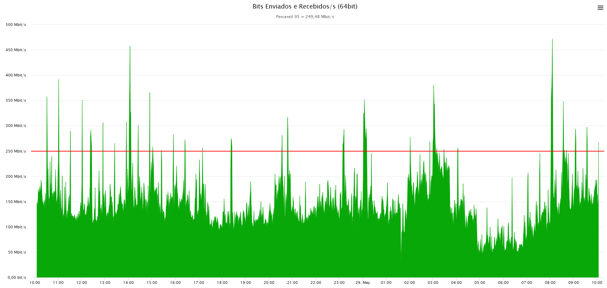
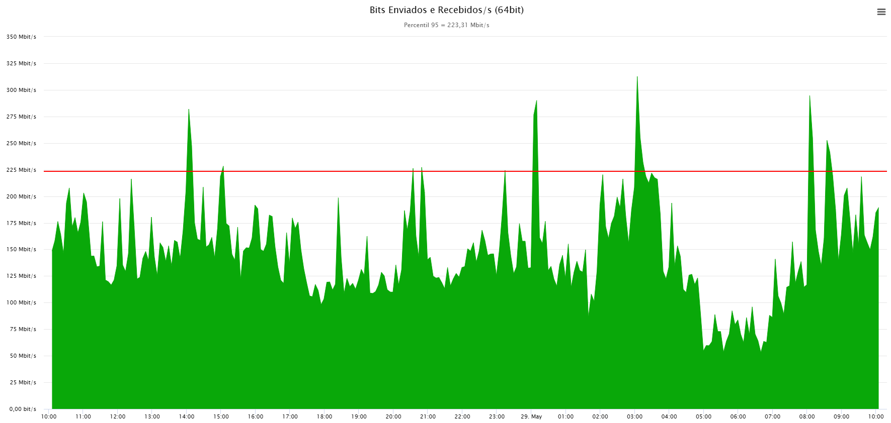
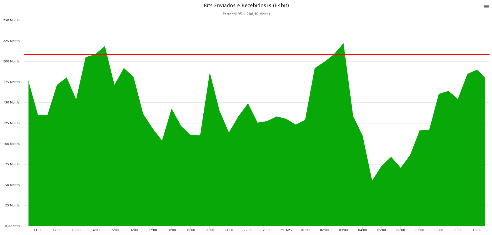

O **Percentil 95** é uma métrica estatística amplamente utilizada em diversas áreas, mas com destaque em **redes de computadores e telecomunicações**, para medir e tarifar o uso de largura de banda e para monitorar o desempenho de sistemas.

## O que é um Percentil?

Um percentil é uma medida que indica o valor abaixo do qual uma dada porcentagem de observações em um conjunto de dados ordenado cai. Por exemplo, o 50º percentil é a mediana, o valor abaixo do qual 50% dos dados se encontram.

## Percentil 95 em Redes de Computadores e Telecomunicações

No contexto de redes, especialmente para provedores de internet (ISPs) e empresas que contratam links dedicados, o Percentil 95 é uma metodologia de **medição e cobrança de tráfego de dados**. A ideia é oferecer um modelo de faturamento mais flexível e justo, que acomode picos de uso ocasionais sem penalizar o cliente com custos excessivos.

### Como funciona?

1. **Coleta de Dados**: O uso de largura de banda é monitorado e amostrado em intervalos regulares, geralmente a cada 5 minutos, ao longo de um período de tempo (tipicamente um mês). Cada amostra representa a média da largura de banda utilizada nesse intervalo.
2. **Ordenação**: Ao final do período de medição, todas essas amostras são coletadas e ordenadas em ordem crescente, do menor uso de banda para o maior.
3. **Descarte dos Picos**: Os **5% maiores valores de uso de largura de banda são descartados**. Isso significa que os picos de tráfego mais elevados e esporádicos, que poderiam inflacionar o custo, não são considerados na cobrança.
4. **Cálculo do Percentil 95**: O próximo valor mais alto após o descarte dos 5% superiores é o **Percentil 95**. Este é o valor que será utilizado para a cobrança. Em outras palavras, 95% do tempo, o uso de largura de banda esteve abaixo ou igual a esse valor.

## Impacto da Granularidade da Amostragem no Percentil 95

No monitoramento de tráfego de dados, a **granularidade da amostragem** — ou seja, a frequência com que os dados são coletados — tem um impacto direto no valor do percentil 95. No experimento abaixo, observamos que o percentil 95 foi **maior em monitoramentos com amostragem a cada 1 minuto** em comparação com monitoramentos com amostragem a cada 5 minutos.

Isso ocorre devido à capacidade inerente da amostragem mais frequente de capturar variações mais rápidas e picos de uso. Vamos detalhar tecnicamente:

### Amostragem a Cada 1 Minuto: Captura mais Precisa de Picos

Quando os dados são amostrados a cada 1 minuto, o sistema de monitoramento registra o tráfego de dados em intervalos muito curtos. Isso permite que ele **capture com maior precisão os picos de uso transitórios e de curta duração**. Imagine um cenário onde há um aumento abrupto no tráfego de dados por 30 segundos e depois ele retorna aos níveis normais. Uma amostragem a cada 1 minuto tem uma alta probabilidade de registrar esse pico, já que o intervalo de coleta possui um intervalo menor entre as amostras.

### Amostragem a Cada 5 Minutos: Suavização dos Picos

Por outro lado, quando a amostragem é realizada a cada 5 minutos, o sistema calcula uma média do tráfego de dados ao longo de um período de 300 segundos. Essa média de tempo maior inerentemente **suaviza os picos de uso**. Se ocorrer um pico de tráfego de curta duração (por exemplo, 30 segundos) dentro de um intervalo de 5 minutos, seu impacto é diluído pela média dos 4 minutos e 30 segundos restantes de tráfego potencialmente mais baixo.

Em termos técnicos, cada amostra de 5 minutos é uma representação agregada do tráfego nesse intervalo. A menor frequência de amostragem resulta em um conjunto de dados mais "suavizado", onde as variações rápidas são menos perceptíveis. Os valores extremos (os picos) são "achatados" devido ao cálculo da média sobre um período mais longo, o que resulta em um percentil 95 menor. Isso não significa que os picos não existam, mas sim que a amostragem com menor granularidade não os registra com a mesma fidelidade.

Como exemplo, o gráfico abaixo possui um intervalo de amostragem a cada 30 minutos. A diferença do percentil 95 para as demais amostragens atenua consideravelmente:

## Conclusão

A escolha da granularidade da amostragem em monitoramento de tráfego de dados é crucial e depende dos objetivos da análise. Para uma **detecção precisa e oportuna de picos de uso** e para entender a capacidade de explosão da rede, uma **amostragem mais granular (como a cada 1 minuto)** é preferível, mesmo que resulte em um percentil 95 mais alto. Isso fornece uma visão mais detalhada e fiel do comportamento da rede em momentos de alta demanda. Se o objetivo é ter uma visão mais consolidada e estável do tráfego médio e descartar flutuações muito rápidas, uma amostragem menos granular (como a cada 5 minutos) pode ser suficiente. É importante estar ciente de que amostras com intervalos grandes pode subestimar a magnitude real dos picos de uso.
